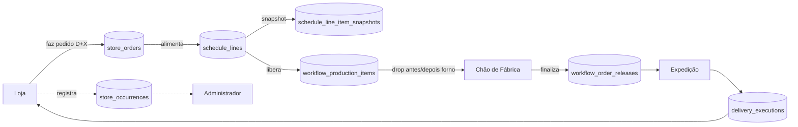
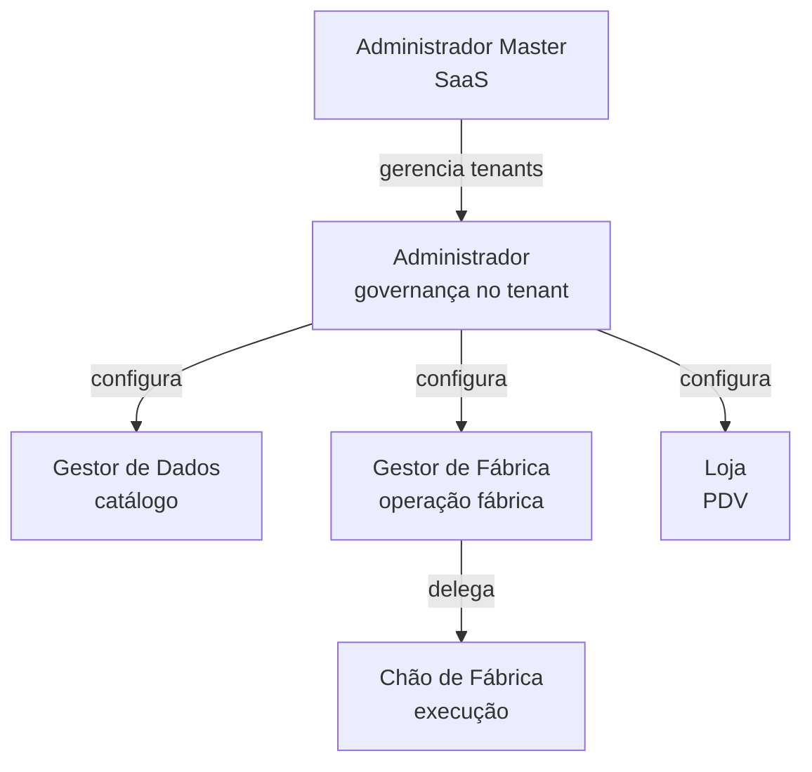

# Visão Geral

## O que é o Xpan

**Xpan** (codinome interno) / **Daniel Augusto v2** (codinome do projeto) é um **ERP SaaS multi-tenant para padarias/confeitarias** com fábrica central e múltiplas lojas. Em português, em fase de refinamento operacional (a maioria dos commits recentes é "ajuste X").

### Para quem
Redes de padaria com **uma fábrica + N lojas**. Cada rede é um **tenant** isolado. O sistema cobre:
- **Pedido das lojas** para a fábrica (por dia, por produto, por D+X).
- **Cronograma de produção** semanal na fábrica (regras D+2/D+3).
- **Execução no chão de fábrica** (ordens de produção, drop antes/depois forno).
- **Expedição** (separação por loja, checklist) e **entrega** (rota, confirmação).
- **Ocorrências** (loja → fábrica → administrador).
- **Dados mestres**: produtos, ingredientes, categorias, lojas, linhas de produção.

### Quem opera
6 [[Personas — Visão Geral|personas]]:
1. **Administrador Master** — opera o SaaS, gerencia tenants.
2. **Administrador** — dentro de um tenant, governança total.
3. **Gestor de Dados** — dados mestres (produtos, ingredientes, lojas).
4. **Gestor de Fábrica** — cronograma, pedidos, OPs, expedição.
5. **Chão de Fábrica** — executa OPs, expedição, entregas.
6. **Loja** — PDV: faz pedido, registra ocorrências.

## Estado atual (2026-05-13)

- 27 módulos de permissão ativos.
- ~25-30 tabelas no schema (ver [[Catálogo de Tabelas]]).
- 25+ migrations aplicadas (ver [[Migrations (cronologia)]]).
- Última leva de saneamento: 4 migrations de 2026-05-05 (lead days, drift, drop antes/depois forno).
- 5 ajustes em maio 2026 (ver [[10 - Changelog Vivo/2026-05|Changelog]]).
- Saúde geral: ver [[Saúde do Sistema]].

## O que não é

- **Não tem PDV real** — "Loja" aqui é a persona que faz pedido para a fábrica, não um caixa.
- **Não tem fiscal/financeiro** — fora do escopo.
- **Não tem inventário detalhado** — apenas estoque de ingredientes em modo simples.

## Diagramas

### Domínio em uma página

### Hierarquia de personas

## Onde está cada coisa no código

| Camada | Local | Páginas no cofre |
|---|---|---|
| App router (UI) | `src/app/{persona}/...` | [[Rotas por Persona]], [[Catálogo dos 27 Módulos]] |
| Componentes | `src/components/...` | — |
| Lib de motor | `src/lib/factory-planning/` | [[Engine — Visão Geral]] |
| Lib de data | `src/lib/supabase-data/` | [[Catálogo de Tabelas]] |
| API routes | `src/app/api/...` | [[APIs — Visão Geral]] |
| Schema | `supabase/migrations/*.sql` | [[Schema ER (Mermaid)]], [[Migrations (cronologia)]] |
| Types do Supabase | `supabase/types.ts` | [[ENUMs]] |
| Permissões | `src/lib/permission-modules.ts` | [[Catálogo dos 27 Módulos]] |
| Autorização de API | `src/lib/api-auth.ts` | [[Autorização de API]] |
| Middleware | `middleware.ts` (raiz) | [[Autenticação e Sessão]] |
