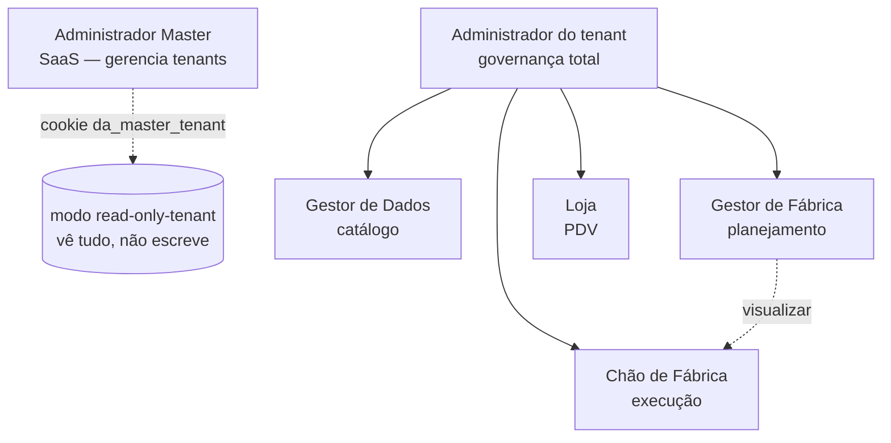

# Personas — Visão Geral

> As 6 personas do Xpan, comparadas em uma página. Definidas pelo enum `UserRole` em `src/lib/auth.ts:1-7` e pelo enum Postgres `public.user_role` (`supabase/migrations/20260309130000_initial_schema.sql:34` + adição de `administrador-master` em `supabase/migrations/20260322105000_master_role_enums.sql:1-30`).

> ⚠️ Atenção: o enum Postgres original tinha **5 valores**. O 6º (`administrador-master`) foi adicionado em 2026-03-22. Dumps anteriores podem divergir.

## Tabela comparativa

| Persona | Escopo | Default | Vê grupos | Caso de uso resumido |
|---|---|---|---|---|
| [[Administrador Master]] | SaaS (global) | `gerenciar` em `administrador-master.*` | só `administrador-master` | Dona da Xpan, gerencia tenants |
| [[Administrador]] | Tenant inteiro | `gerenciar` em todos não-master | `administrador` + 4 operacionais | Super-usuário da padaria cliente |
| [[Gestor de Dados]] | Catálogo do tenant | `gerenciar` em `gestor-dados.*` | só `gestor-dados` | Cadastra produtos, ingredientes, lojas |
| [[Gestor de Fábrica]] | Operação fábrica | `gerenciar` em `gestor-fabrica.*` + `visualizar` em `chao-fabrica.*` | `gestor-fabrica` + `chao-fabrica` | Planeja produção, libera ordens |
| [[Chão de Fábrica]] | Execução | `operar` em `chao-fabrica.*` | só `chao-fabrica` | Executa OPs, expedição, entregas |
| [[Loja]] | Loja (filtrado por `storeIds`) | `operar` em `loja.*` | só `loja` | Faz pedidos, registra ocorrências |

Default vem de `buildDefaultPermissions` em `src/lib/permission-modules.ts:449-481`. Grupos por persona em `roleAllowedGroups` (`src/lib/permission-modules.ts:484-491`).

## Diagrama hierárquico

## Pontos de atenção

- **`administrador` é super-usuário** dentro do tenant — `gerenciar` em **todos** os módulos não-master por padrão. Use com parcimônia.
- **`chao-fabrica` tem `operar`, não `gerenciar`** — não pode criar/excluir, só executar. Diferença sutil mas importante.
- **`loja` tem escopo extra por `storeIds`** — filtro adicional aplicado em `getAllowedStoreIds` (`src/lib/api-auth.ts:111-128`). Usuário `loja` só vê pedidos/ocorrências das lojas associadas em `profile_store_access`.
- **`administrador-master` em modo read-only-tenant**: cookie `da_master_tenant` injeta `gerenciar` em módulos não-master via `buildMasterTenantReadOnlyPermissions` (`src/lib/master-access-context.ts:18-28`), mas `canWriteInAccessMode` (`src/lib/tenant.ts:21-23`) bloqueia escrita. **Defesa em camadas:** `src/lib/api-permission-context.ts:22-42` e `src/lib/app-shell.ts:38-41` garantem que master ainda consegue acessar suas próprias APIs.

## Para ir além

- [[Matriz Persona × Módulo]] — tabela completa 24×6
- [[Rotas por Persona]] — todo `page.tsx` por persona
- [[Modelo 4 Níveis × 27 Módulos]] — ranks de permissão
- [[Autenticação e Sessão]] · [[Autorização de API]]
