# Integrações entre Jornadas — Handoffs e Triggers

> Como `pedido → cronograma → produção → expedição → entrega → ocorrência` se encadeiam. Onde os contratos são implícitos, frágeis ou divergem entre camadas.

## 1. Mapa de handoffs

```mermaid
flowchart LR
    subgraph Loja[Loja]
      A1[/loja/pedidos/]
    end
    subgraph FabricaPlan[Gestor de Fábrica]
      A2[/gestor-fabrica/pedidos/]
      A3[/gestor-fabrica/ordens-producao/]
      A4[/gestor-fabrica/expedicao/]
    end
    subgraph ChaoExec[Chão de Fábrica]
      B3[/chao-fabrica/ordens-producao/]
      B4[/chao-fabrica/expedicao/]
      B5[/chao-fabrica/entregas/]
    end
    subgraph OccCh[Canais de Ocorrência]
      C1[/loja/ocorrencias/]
      C2[/gestor-fabrica/ocorrencias/]
      C3[/administrador/ocorrencias/]
      C4[/administrador-master/clientes/]
    end

    A1 -- store_orders + store_order_items<br/>event 'criacao' --> A2
    A2 -- workflow_order_releases<br/>event 'liberacao_producao' --> A3
    A3 -- workflow_production_items<br/>event 'producao_status' --> B3
    B3 -- progress=100 derivado<br/>(status='aguardando_expedicao') --> A4
    A4 -- delivery_executions checklist<br/>event 'entrega_status' --> B4
    B4 -- status=pronto_coleta --> B5
    B5 -- status=em_rota/no_destino/entregue --> A1
    B5 -- gate canOpenOccurrence --> C1
    C1 -- store_occurrences --> C2
    C3 -- tenant_support_occurrences --> C4
```



## 2. Tabela de handoffs (contratos)

| # | De | Para | Mecanismo | Contrato | Validação | Quem dispara |
|---|----|------|-----------|----------|-----------|--------------|
| 1 | Loja (POST /api/store-orders) | Gestor de Fábrica | `store_orders` + `store_order_items` + `appendStoreOrderEvent('criacao')` + `invalidatePlanningCaches(tenantId)` | Pedido inserido; cache invalida em até 10s | `validateStoreOrderItems` (catálogo+janela) | Loja humana |
| 2 | Gestor de Fábrica (PATCH workflow release-order) | Engine + Chão | `workflow_order_releases` row + event `liberacao_producao` + cache invalidado | Itens passam a `releasedToProduction=true` na próxima leitura | `availableForRelease` no client; **server não revalida** | Gestor humano |
| 3 | Chão de Fábrica (PATCH update-production-item-status) | Loja (via timeline) | `workflow_production_items` upsert + `appendOrderEventsForProductionItem` cria N eventos (1 por pedido afetado) | Status sobe; loja vê na timeline em `/loja/pedidos/[orderId]` | `canTransitionProductionItemStatus` (±1 estágio) | Chão humano |
| 4 | Engine (derivação) | Expedição | Quando todos `productionItemStatus = concluido` → `getAverageProgress(items)>=100` → `PlannedOrderRow.status = aguardando_expedicao` (`engine.ts:740-747`) | Pedido fica elegível em `isOrderReadyForDeliveryExecution` | **derivação implícita**; nenhum job persiste a transição | Snapshot calculado on-the-fly |
| 5 | Chão (PATCH /api/delivery-executions) | Loja (timeline + KPIs) | `delivery_executions` upsert (status, checklist_state, checklist_completed_at) + `appendStoreOrderEvent('entrega_status')` | Status visível em `getExpeditionVisibleStatus`; loja recebe gating de ocorrência | `canTransitionDeliveryStatus`, `areAllChecklistItemsChecked` | Chão humano |
| 6 | Status `em_rota` → Loja | Loja (botão "Abrir ocorrência" habilita) | `delivery_executions.status in (em_rota,no_destino,entregue)` | `canOpenOccurrenceForDeliveryStatus` em `assertOccurrenceCanBeOpened` | UI + server | Status muda |
| 7 | Loja POST /api/store-occurrences | Fábrica | `store_occurrences` + `store_occurrence_events` | KPI `ocorrenciasAbertas` sobe | `resolveOrderStoreScope` + status válido | Loja humana |
| 8 | Master cria tenant (POST /api/master/clients) | Administrador do tenant | `tenants` + `operational_settings` + `profiles` admin + `user_permissions` + auth user | Tenant fica `ativo`, senha temporária retornada | `assertTenantAdminEmailAvailable`, transação com rollback | Master humano |
| 9 | Admin do tenant (POST /api/admin/support-occurrences) | Master | `tenant_support_occurrences` | Aparece em `/administrador-master/clientes/[tenantId]` | Validação de payload em `normalizeCreatePayload` | Admin humano |

## 3. Tabela de eventos cronológicos (`store_order_events`)

Todos os tipos que aparecem na timeline do pedido (`/loja/pedidos/[orderId]`):

| Tipo | Disparado por | Arquivo |
|------|---------------|---------|
| `criacao` | `createStoreOrder` | `store-orders.ts:406-421` |
| `edicao` | `updateStoreOrder` | `store-orders.ts:465-478` |
| `cancelamento` | `cancelOrder` | `workflow.ts:316-325` |
| `reabertura` | `reopenOrder` | `workflow.ts:354-363` |
| `liberacao_producao` | `releaseOrder` | `workflow.ts:177-186` |
| `producao_status` | `updateProductionItemStatus` (1 evento por pedido afetado) | `workflow.ts:68-107` |
| `entrega_status` | `updateDeliveryExecution` | `delivery.ts:285-298` |

## 4. Caches e invalidação

```
+---------------------------+      +----------------------------+
| planning cache            |      | delivery executions cache  |
| TTL 10s, key=             |      | TTL 10s, key=              |
| tenantId|planning|ref|... |      | tenantId|delivery|all      |
+-----+---------------------+      +------+---------------------+
      | invalidado por                       | invalidado por
      | - createStoreOrder                   | - updateDeliveryExecution
      | - updateStoreOrder                   |
      | - cancelOrder / reopenOrder          |
      | - releaseOrder                       |
      | - updateProductionItemStatus         |
      +--------------------------------------+
```

Tudo via `invalidatePlanningCaches(tenantId)` / `invalidateDeliveryExecutionCaches(tenantId)` em `src/lib/server-data-cache.ts`.

## 5. Triggers de banco (não encontrados)

A operação é **toda orquestrada pela camada de aplicação** (`src/lib/supabase-data/*`). Não foram encontrados:
- Triggers SQL/RLS que mudem `store_orders.status` quando OPs avançam.
- Functions/edge-functions que reconciliem `delivery_executions` ↔ `store_orders.delivery_state`.
- Jobs agendados (Supabase scheduled functions) para promoção automática de status.

> Consequência: **o status do pedido é sempre derivado em tempo de leitura** (`engine.ts`). Não há "fonte da verdade" persistida para `OrderStatus`. Múltiplos clientes podem ver status diferentes antes do TTL de 10s.

## 6. Top 5 handoffs frágeis ou ambíguos

### 6.1 Engine → "aguardando_expedicao" (HANDOFF #4)
- **Sintoma:** A promoção do pedido para "pronto para expedição" é **derivada** em tempo de execução de `buildOrders` (`engine.ts:806-853`) — não há registro persistido dessa transição em `store_orders`.
- **Risco:** Se o engine mudar a regra (ex: incluir um estágio), pedidos antigos "viram" sem evento na timeline. A loja não vê quando seu pedido ficou pronto para expedição (não há evento `producao_finalizada`).
- **Contrato implícito:** progress = média de `getProductionStatusProgress` dos `sourceItems`; depende silenciosamente de `defaultProductPreparationStages`.

### 6.2 Chão → "produção" sem trava de release (HANDOFF #3)
- **Sintoma:** `updateProductionItemStatus` valida transição de estágio, mas **não exige** que `workflow_order_releases` exista para os pedidos relacionados (`workflow.ts:189-246`).
- **Risco:** Operador com `productionItemKey` válido pode mexer em produção de pedido cancelado / não liberado. UI esconde, server não rejeita.
- **Contrato implícito:** "se a UI mostra a OP, então está liberada" — não auditado server-side.

### 6.3 `productionItemKey` único compartilhado entre pedidos (HANDOFF #3 fan-out)
- **Sintoma:** Vários pedidos podem compartilhar o mesmo `productionItemKey` (mesmo dia + linha + cronograma + produto). Avançar status afeta **todos** (`workflow.ts:86-106` distribui evento por `uniqueOrders`).
- **Risco:** Status mostrado por pedido é a média do agregado — se um pedido isolado precisa "ficar para trás" (ex: separar do lote), não há mecanismo. Cancelar um pedido **não** desfaz o status de produção, porque a chave segue compartilhada.
- **Falta de contrato:** quem é o "dono" do `productionItemKey` quando há fan-out? Hoje nenhuma persistência identifica isso.

### 6.4 Checklist de expedição ↔ aggregator (HANDOFF #5)
- **Sintoma:** `buildChecklistItemKeys` em `delivery.ts:93-107` reconstrói chaves a partir de `aggregateExpeditionItems`. Se um produto mudar de `expeditionUnit` entre snapshot e checklist atualizado, **chaves antigas em `checklist_state` não batem mais** com as esperadas.
- **Risco:** `areAllChecklistItemsChecked` retorna `false` indefinidamente — pedido trava em `aguardando_expedicao` sem mensagem clara.
- **Contrato implícito:** unidades do produto **não devem mudar** após pedido criado (não há snapshot da chave de checklist).

### 6.5 Status do pedido visto pela loja (`resolveStoreVisibleOrderStatus`)
- **Sintoma:** Em `/api/store-orders` (`route.ts:81`) e em `/api/store-orders/[id]` (`route.ts:143-146`), o status mostrado para a loja resulta da combinação `(orderStatus, executionStatus)` via `resolveStoreVisibleOrderStatus`.
- **Risco:** Se houver `delivery_executions` row mas `getFactoryPlanningSnapshot` ainda calcula `em_producao` (cache stale ou progresso != 100), a loja pode ver "Em rota" antes do pedido estar técnicamente concluído na produção.
- **Contrato implícito:** confia que `isOrderReadyForDeliveryExecution` foi enforced no `updateDeliveryExecution` — mas o gating é apenas a validação anterior; não há FK lógica entre `delivery_executions` e a finalização de produção.

## 7. Outras observações úteis (não top 5)

- **Reabertura** de pedido cancelado **não** recria release nem reverte `delivery_executions`. Se um pedido com entrega registrada virar `cancelado` por algum caminho não previsto, fica em estado inconsistente.
- A **timeline da ocorrência** (`store_occurrence_events`) e a **timeline do pedido** (`store_order_events`) são **disjuntas** — uma ocorrência que muda status não afeta a timeline do pedido relacionado e vice-versa.
- O canal `tenant_support_occurrences` é **totalmente isolado** do canal `store_occurrences` — não há ponte para escalar uma ocorrência de pedido para o master.
- `business_codes` (sequência por prefixo PD/OC/etc) é alocado por `allocateBusinessCode` (`business-codes.ts`): incrementa por mês ou tenant — concorrência alta pode gerar gap (não bug, mas auditoria nota).
