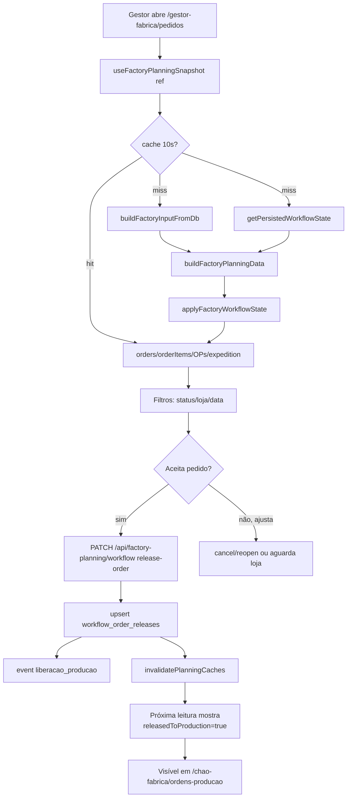

# Jornada 2 — Cronograma da Semana

> Gestor de Fábrica abre auditoria → revisa snapshot de pedidos consolidados → libera para produção. Como a priorização funciona.

## Atores envolvidos

| Ordem | Persona | Permissão | Papel |
|------:|---------|-----------|-------|
| 1 | **Gestor de Fábrica** (`gestor-fabrica.dashboard` ≥ `visualizar`) | Lê snapshot |
| 1 | **Gestor de Dados** (`master_data` permissões) | Mantém cronogramas/produtos (pré-jornada) |
| 2 | (motor) `factory-planning/engine.ts` | Reconstrói cronograma a cada referência |
| 3 | **Gestor de Fábrica** (`gestor-fabrica.pedidos` ≥ `operar`) | Libera para produção |

## Pré-condições

- Cronogramas (`weekly_production_schedules` + itens) ativos e cobrindo `referenceDate`.
- Linhas (`production_lines`) ligadas a cronogramas com dias da semana (`scheduleItemDays`).
- Produtos com `productionDays` (ficha) e fatores `salesToKgFactor` / `expeditionToKgFactor` configurados.
- Pelo menos um pedido `ativo` no horizonte da janela.

## Passos numerados

### Passo 1 — Gestor escolhe a janela
- **UI:** `OperationalDateScopeCard` em `src/app/gestor-fabrica/pedidos/page.tsx:240-249` (idem em ordens-producao e expedicao).
- `useOperationalDateScope` produz `scope/anchorDate` que serão usados para filtrar tudo.

### Passo 2 — Snapshot é montado pelo servidor
- **API:** `GET /api/factory-planning?referenceDate=YYYY-MM-DD` (`src/app/api/factory-planning/route.ts:13-45`).
- **Server:** `getFactoryPlanningSnapshot` (`src/lib/supabase-data/planning-snapshot.ts:16-60`):
  1. Cache `tenantId+ref+profilesFlag` por 10s (`FACTORY_PLANNING_CACHE_TTL_MS`).
  2. Em paralelo:
     - `buildFactoryInputFromDb` (`store-orders.ts:307-342`) — junta `master-data` (stores, settings, sectors, lines, products, schedules) com `listFactoryStoreOrders`.
     - `getPersistedWorkflowState` (`workflow.ts:27-66`) — lê `workflow_order_releases`, `workflow_production_items.status` e `store_orders.management_status`.
  3. `buildFactoryPlanningData(ref, input)` em `factory-planning/engine.ts:944-988`:
     - `buildPlannedItems` calcula janela, `productionDate`, `productionItemKey` (linhas 540-605).
     - `buildProductionOrdersFromPlannedItems` agrega por sector/line/schedule/data → cria OPs (`engine.ts:611-803`).
     - `buildOrders` consolida totais por pedido, status, `opsLabel` (linhas 806-853).
     - `buildExpeditionRows` cria linhas de expedição por pedido + `expeditionItems` por produto (linhas 855-942).
  4. `applyFactoryWorkflowState` injeta status/release/cancel do workflow no snapshot (`factory-workflow-logic.ts`).

### Passo 3 — Filtros e visualização
- **UI fila:** `gestor-fabrica/pedidos/page.tsx:357-487`. Cada linha mostra:
  - `code`, `storeName`, `deliveryDateLabel`, `dPlusLabel`, `StatusBadge`.
  - Expansão inline com KPIs (`itens originais`, `itens consolidados`, `kg totais`).
  - Modal "Itens consolidados" usa `aggregateOrderItems` (`order-item-aggregation.ts`).
- **Filtros operativos:** `status`, `store`, `delivery date`, `search`. `OperationFiltersCard` (linhas 289-345).
- **Sort temporal:** `sortItemsByTemporalValue` em `temporal-table-sort.ts` (recent/oldest first).

### Passo 4 — Priorização (como funciona)
- A priorização **não** é manual; é derivada do **schedule item**.
- `getScheduleItemDayPriority(scheduleItem, weekday)` (`production-data-utils.ts`) calcula `scheduleDayPriority` por item (`engine.ts:551-554`).
- Em `buildProductionOrdersFromPlannedItems`, itens da OP são ordenados por `productionSequence ?? MAX_SAFE_INTEGER` (linhas 768-789), depois `productCode`.
- Linha do dia (`DailyLineRow` em `chao-fabrica/ordens-producao/page.tsx`) consolida kg por linha/dia para visualização tipo "cargas".

### Passo 5 — Liberação para produção
- Mesmo passo 5 da jornada 30. **Após release**: `workflow_order_releases` ganha linha; próxima leitura do snapshot marca `releasedToProduction = true` em `PlannedOrderItem` e em `ProductionOrderRow.releasedToProduction`.
- Apenas pedidos liberados aparecem em `chao-fabrica/ordens-producao` (jornada 32).

### Passo 6 — Reabertura (rollback do cronograma)
- Reabrir um pedido cancelado revive o item no planning, mas não recria o release; o gestor precisa liberar novamente.

## Como o status do pedido sobe automaticamente

- `getOrderStatusFromItems` é derivado em `engine.ts:740-747` para cada **OP** (não para o pedido), e depois `buildOrders` agrega via `getAverageProgress` + `getOrderStatusFromItems` em `PlannedOrderRow.status`.
- Progress: `productionStageProgress` em `engine.ts:61-68` usa `getProductionStatusProgress(...)` por estágio (`production-workflow.ts`).
- Transição automática:
  - `progress = 0` e `productionDate >= ref` → `agendado`
  - `progress > 0` → `em_producao`
  - `progress >= 100` → `aguardando_expedicao`
- A partir daí entra a **execução de entrega** (jornada 33).

## Diagrama (Mermaid flowchart)



## Pós-condições

- Snapshot atualizado servido em cache (`getCachedServerData`).
- `productionItemKey` previsível: `productionDate|lineId|scheduleId|productId` (`engine.ts:555-562` + helper `getProductionItemKey`).
- `opCode` calculado `OP-AAAMMDD-NNN` (`engine.ts:736`).

## Pontos de falha conhecidos

| Falha | Origem | Efeito |
|-------|--------|--------|
| Produto sem cronograma cobrindo o dia | `canPlan = false` em `engine.ts:550` | Item fica como `em_espera`, **sem `productionItemKey`** — não dá para iniciar produção |
| Loja sem `receivingDays` no dia D+X | `moveToNextAllowedWeekday` (`engine.ts:131-145`) | Adia entrega até 7 dias, depois retorna data original (silencioso) |
| Linha sem cronograma ativo | `buildActiveScheduleByLine` | OP nunca aparece — pedido fica sem `productionDate` |
| Cache stale entre nós | `FACTORY_PLANNING_CACHE_TTL_MS = 10_000` | Outro gestor pode ver pedido pré-release por até 10s |
| `scheduleDayPriority` ausente | Item de cronograma sem `daysPriority` | Cai para `MAX_SAFE_INTEGER` — ordem "casual" por `productCode` |

## Estados (do PlannedOrderItem/ProductionOrderRow)

```
nao_iniciado → em_preparacao → em_producao → em_forno → embalando → concluido
```
(produção; vide jornada 32). E no nível do pedido:
```
em_espera → agendado → em_producao → aguardando_expedicao → (delivery_executions)
```
