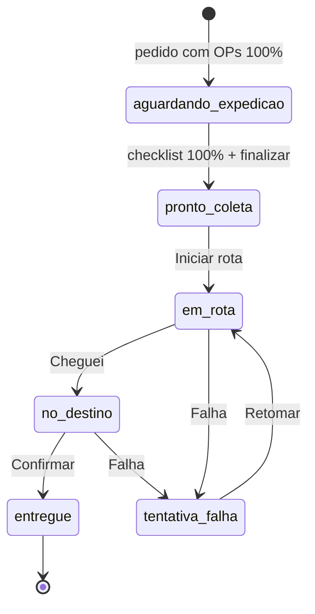
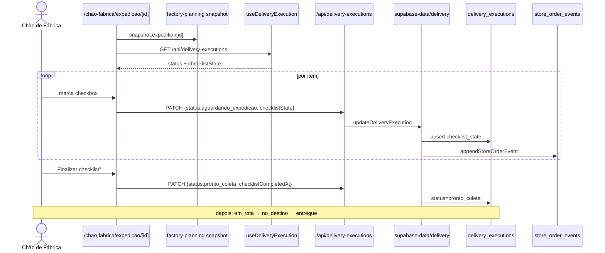

# Jornada 4 — Expedição e Entrega

> Pós-produção: agrega itens por pedido → operador faz checklist de separação → marca "pronto para coleta" → entrega passa pelas etapas em rota / no destino / entregue.

> [!note] Atualizado em 2026-05-21 — iniciativa A1-A8
> Duas mudanças estruturais na jornada:
>
> - **Tentativa de falha estruturada (A3):** transição para `tentativa_falha`
>   agora abre **diálogo obrigatório** com motivo (enum de 8 valores) +
>   observação + reagendamento opcional. Cada falha grava linha nova em
>   `delivery_attempts` (append-only) — não sobrescreve mais. Badge histórica
>   na linha quando há tentativas prévias. Ver [[Runbook A1-A8#3. Tentativa de entrega falhada — registro estruturado|Runbook §3]] e a observação de risco "Rota/zona simuladas" abaixo (resolvida pelo A8).
> - **Roteirização honesta (A8):** `buildRouteMeta` hash-based foi substituído
>   por `buildDeliveryRoutes`. Agrupa por `store.delivery_zone` (texto livre
>   cadastrado em `/gestor-dados/lojas` — ver A8.1) com fallback por janela
>   de recebimento. Ver [[Runbook A1-A8#5. Cadastrar `delivery_zone` das lojas|Runbook §5]].
>
> Referência completa: [[decisoes/ADR_iniciativa_automacao_pedido_entrega]].

## Atores envolvidos

| Ordem | Persona | Permissão | Papel |
|------:|---------|-----------|-------|
| 1 | **Chão de Fábrica** | `chao-fabrica.expedicao` ≥ `operar` | Faz o checklist |
| 1 | **Gestor de Fábrica** | `gestor-fabrica.expedicao` ≥ `operar` | Acompanha / pode atuar |
| 2 | **Chão de Fábrica** (entregas) | `chao-fabrica.expedicao` | Avança rota até entrega |
| 3 | **Loja** | `loja.pedidos` (read) | Vê status atualizado; pode abrir ocorrência após `em_rota` (jornada 34) |

## Pré-condições

- Pedido com `PlannedOrderRow.status = "aguardando_expedicao"` (`isOrderReadyForDeliveryExecution` em `delivery-workflow.ts:55-57`).
- Todos os `productionItemStatus` da OP em `concluido`.
- Tenant tem schema com `delivery_executions` (checklist + status). Caminho legado existe (`delivery.ts:200-223`) sem checklist.

## Passos numerados

### Passo 1 — Pedido entra na fila de expedição
- **Origem do dado:** `getFactoryPlanningSnapshot` calcula `expedition` em `buildExpeditionRows` (`engine.ts:855-917`).
- **UI:** `src/app/chao-fabrica/expedicao/page.tsx` e versão gestor `gestor-fabrica/expedicao/page.tsx`.
- Cada linha mostra `orderCode`, `storeName`, `deliveryDateLabel`, `totalKg`, `itemsCount`, `visibleStatus` (orderStatus OR executionStatus via `getExpeditionVisibleStatus`).

### Passo 2 — Operador abre checklist
- **UI:** `src/app/chao-fabrica/expedicao/[expeditionId]/page.tsx`.
- Carrega:
  - `expedition` via `useFactoryPlanningSnapshot`
  - `useDeliveryExecution()` (`src/lib/delivery-execution.ts:84-218`) → `GET /api/delivery-executions` agregado.
- `aggregateExpeditionItems(items)` consolida por `productId|requestedUnit|expeditionUnit` (`expedition-aggregation.ts`).
- `getChecklistItemKey` (linha 27-29) gera a chave persistida.
- `checklistEditable = canSeparate && execution.status === "aguardando_expedicao"` (linha 69) — depois disso, congelado.

### Passo 3 — Operador marca itens
- **Ação:** clica checkbox de cada item (ou "Marcar tudo").
- **API:** `PATCH /api/delivery-executions` body `{ orderId, status, checklistState, checklistCompletedAt }` (`route.ts:54-103`).
- **Server:** `updateDeliveryExecution` (`delivery.ts:173-299`):
  1. `resolveOrderDeliveryExecutionContext` — junta pedido + planning + expedition.
  2. Valida `isOrderReadyForDeliveryExecution(orderStatus)`. Se não, 400 "ainda não está pronto".
  3. Valida `canTransitionDeliveryStatus` (grafo em `delivery-workflow.ts:14-21`).
  4. `buildChecklistItemKeys(expedition)` — chaves esperadas a partir da agregação.
  5. `areAllChecklistItemsChecked` — verifica antes de avançar de `aguardando_expedicao`.
  6. Upsert `delivery_executions` `{order_id, status, checklist_state, checklist_completed_at, updated_at, updated_by_profile_id}` ou versão legacy.
  7. `appendStoreOrderEvent("entrega_status", description)` em `store_order_events`.
  8. `invalidateDeliveryExecutionCaches(tenantId)`.

### Passo 4 — Fechar checklist → `pronto_coleta`
- **UI:** botão "Finalizar checklist" só ativo se `allItemsChecked` (`expedition/[id]/page.tsx:143-149`).
- Server valida: para sair de `aguardando_expedicao`, todas as chaves esperadas precisam estar `true` (`delivery.ts:243-245`).
- Marca `checklist_completed_at` quando status `= 'pronto_coleta'` (`delivery.ts:258-261`).

### Passo 5 — Rota e entrega
- **UI:** `src/app/chao-fabrica/entregas/page.tsx` (rotas, zonas).
- **Transições do grafo** (`delivery-workflow.ts:14-21`):
  ```
  pronto_coleta → em_rota
  em_rota → no_destino | tentativa_falha
  no_destino → entregue | tentativa_falha
  tentativa_falha → em_rota
  entregue → (final)
  ```
- Mesma API `PATCH /api/delivery-executions` para cada step. Mesma função server-side `updateDeliveryExecution`.
- `getNextDeliveryAction` (`delivery-workflow.ts:34-49`) define o label do botão por status.

### Passo 6 — Confirmação
- Ao chegar em `entregue`, evento `entrega_status` é registrado com a descrição "Entregue".
- A loja vê na timeline (`/loja/pedidos/[orderId]`) e ganha acesso a abrir **ocorrências** (`canOpenOccurrence` em `store-order-workflow.ts` exige `em_rota|no_destino|entregue`).

## Máquina de estados (delivery_executions.status)



## Diagrama de sequência



## Pós-condições

- `delivery_executions` (1 linha por pedido, `onConflict: order_id`) com checklist e status final.
- `store_order_events` com trilha (1 evento por mudança de status).
- `PlannedOrderRow.status` no snapshot avança para `entregue` indiretamente via `resolveStoreVisibleOrderStatus` (mostrado na lista da loja).

## Pontos de falha conhecidos

| Falha | Origem | Tratamento |
|-------|--------|------------|
| Schema legacy sem `checklist_state` | `isMissingDeliveryExecutionSchema` (`delivery.ts:125-131`) | Caminho de fallback grava só status; checklist vira no-op |
| Tentar avançar sem checklist completo | `delivery.ts:243-245` | Erro 400 "Conclua o checklist..." |
| Pedido não em `aguardando_expedicao` | `delivery.ts:191-193` | Erro 400 "ainda não está pronto" |
| Transição inválida (ex: `entregue → em_rota`) | `canTransitionDeliveryStatus` | Erro 400 "Invalid delivery status transition" |
| Item operacional concluído mas não aparece no checklist | divergência entre `aggregateExpeditionItems` (chave) e `buildChecklistItemKeys` (mesma agregação) | Em tese alinhados, mas mudança de unidade no produto quebra chaves antigas |
| Race: dois operadores marcam ao mesmo tempo | upsert atômico, `checklistState` é objeto inteiro | Último wins — pode "destildar" item recém marcado por outro |

## Riscos / áreas frágeis

- ~~**Rota/zona** são **simuladas no cliente** via `hashCode` da combinação `orderCode+store+deliveryDate` (`chao-fabrica/entregas/page.tsx:44-62`).~~ **Resolvido em 2026-05-21 (A8):** `buildRouteMeta` substituído por `buildDeliveryRoutes` (`src/lib/delivery-routing.ts`). Agrupa por `store.delivery_zone` com fallback por janela. Sem geo inventado.
- ~~**Tentativa de falha** não captura motivo estruturado — só altera status. Nenhuma tabela `delivery_attempts` foi encontrada.~~ **Resolvido em 2026-05-21 (A3):** tabela `delivery_attempts` append-only + enum `delivery_failure_reason` (8 valores) + dialog estruturado. Bugfix de auditoria garantiu que mobile e desktop usam o mesmo caminho.
- A janela entre `entregue` e a abertura de **ocorrência** (jornada 34) não tem prazo definido em código.
