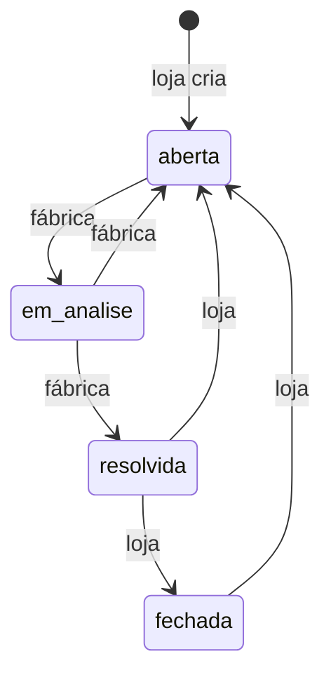
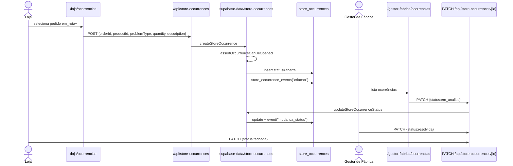
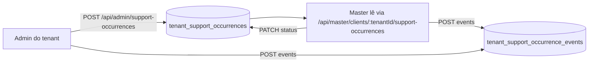

# Jornada 5 — Ocorrências

> Loja registra uma ocorrência (produto faltando, errado, danificado) → Fábrica faz triagem → resolve → fecha. Existem **dois canais separados**: `store_occurrences` (loja↔fábrica) e `tenant_support_occurrences` (administrador do cliente ↔ master).

## Cenário A — Ocorrência de pedido (loja ↔ fábrica)

### Atores

| Ordem | Persona | Permissão | Papel |
|------:|---------|-----------|-------|
| 1 | **Loja** | `loja.ocorrencias` ≥ `operar` | Abre ocorrência |
| 2 | **Gestor de Fábrica** | `gestor-fabrica.ocorrencias` ≥ `operar` | Triagem e resolução |
| 2 | (alt) **Administrador** | `administrador.ocorrencias` (rota visualiza) | Pode reagir como gestor |

### Pré-condições

- Pedido com `delivery_executions.status` em `em_rota`, `no_destino` ou `entregue` — validado em `canOpenOccurrenceForDeliveryStatus` (`store-occurrence-workflow.ts`).
- Usuário com acesso à loja do pedido (`resolveOrderStoreScope` em `store-occurrences.ts:90-107`).

### Passos numerados

#### Passo 1 — Loja abre ocorrência
- **UI:** `src/app/loja/ocorrencias/page.tsx:83-...`.
- Loja seleciona pedido (via `useStoreOrderSummaries` filtrado por `eligibleOccurrenceStatuses = ["em_rota","no_destino","entregue"]` — linha 59), produto (do pedido), tipo de problema, quantidade, descrição.
- **API:** `POST /api/store-occurrences` (`route.ts:73-120`).
- **Server:** `createStoreOccurrence` (`store-occurrences.ts:203-312`):
  1. `validateStoreOccurrenceDraft` — normaliza problemType/quantityType/quantity.
  2. Resolve `order_id`, `product_id`, `order_item_id` (com cruzamento: item pertence à ordem; produto bate com item).
  3. `resolveOrderStoreScope` — confere `allowedStoreIds`.
  4. `assertOccurrenceCanBeOpened` (linhas 109-132) — lê `delivery_executions.status` + `orderStatus` e valida com `canOpenOccurrenceForDeliveryStatus`.
  5. `allocateBusinessCode("OC", createdAtIso)` → `code`.
  6. Insert em `store_occurrences` `{legacy_id, code, order_id, product_id, problem_type, quantity_type, quantity, status:'aberta', opened_by_profile_id}`.
  7. `appendStoreOccurrenceEvent("criacao", content, metadata)` em `store_occurrence_events`.
- **Tabelas mutadas:** `store_occurrences`, `store_occurrence_events`, `business_codes`.

#### Passo 2 — Fábrica recebe na fila
- **UI:** `src/app/gestor-fabrica/ocorrencias/page.tsx`.
- `useStoreOccurrences()` → `GET /api/store-occurrences` (`route.ts:38-71`), listando todas as ocorrências respeitando `allowedStoreIds` (gestor master vê tudo).

#### Passo 3 — Triagem (aberta → em_analise)
- **UI:** botão "Iniciar análise" (`gestor-fabrica/ocorrencias/page.tsx:37-54`).
- **API:** `PATCH /api/store-occurrences/[occurrenceId]` (`route.ts:74-116`).
- **Server:** `updateStoreOccurrenceStatus` (`store-occurrences.ts:314-377`):
  - Valida `canTransitionStoreOccurrenceStatus(current, next, actorRole)` em `store-occurrence-workflow.ts`.
  - Cada papel tem permissões diferentes (loja não pode "em_analise", por exemplo).
  - Atualiza `store_occurrences` (incluindo `analyzed_by_profile_id`, `resolved_at`, conforme `buildStoreOccurrenceStatusUpdate`).
  - Grava evento `mudanca_status` com `from`/`to`.

#### Passo 4 — Comentários
- Tanto loja quanto fábrica podem comentar (rota loja envia o comentário via `addStoreOccurrenceComment` → POST `/api/store-occurrences/[id]/events`, vide pasta `events/`).
- Grava `store_occurrence_events` (tipo `comentario`) e dá um `touch` em `store_occurrences.updated_at`.

#### Passo 5 — Resolução
- Gestor → "Marcar resolvida" → status `resolvida`.
- Loja vê na própria tela e tem duas opções:
  - "Confirmar fechamento" → `fechada` (final).
  - "Reabrir" → volta a `aberta`.

### Máquina de estados (store_occurrences.status)

Transições permitidas dependem de `actorRole` (loja|gestor-fabrica|administrador).

### Diagrama de sequência

### Pós-condições

- Linha em `store_occurrences` com status final (`fechada` ou `aberta`/`resolvida` pendente).
- Eventos cronológicos em `store_occurrence_events`.
- Indicador visível no KPI da loja: `orderKpis.ocorrenciasAbertas` (`/loja/pedidos`).

### Pontos de falha

| Falha | Origem | Efeito |
|-------|--------|--------|
| Tentar criar ocorrência antes do pedido sair para entrega | `assertOccurrenceCanBeOpened` (`store-occurrences.ts:109-132`) | 400 "can only be opened for orders already on route or delivered" |
| Item de pedido + produto incoerentes | `store-occurrences.ts:262-268` | 400 "does not belong / does not match" |
| Transição inválida pelo papel | `canTransitionStoreOccurrenceStatus` | 400 "Invalid occurrence status transition" |
| `allowedStoreIds` não contém a loja do pedido | `resolveOrderStoreScope` | 403 "does not have access" |

---

## Cenário B — Suporte tenant ↔ master (`tenant_support_occurrences`)

### Atores

| Ordem | Persona | Permissão | Papel |
|------:|---------|-----------|-------|
| 1 | **Administrador** (do tenant) | `administrador.ocorrencias` ≥ `operar` | Abre chamado para o master |
| 2 | **Administrador Master** | `administrador-master` | Responde, muda status |

### Passos numerados

1. **Admin do cliente abre chamado**
   - UI: `src/app/administrador/ocorrencias/page.tsx`.
   - API: `POST /api/admin/support-occurrences` (`route.ts:101-152`).
   - Server: `createTenantSupportOccurrence` (`supabase-data/tenant-support-occurrences.ts`).
   - Insere em `tenant_support_occurrences` `{title, category, priority, description, status:'aberta'}` + evento em `tenant_support_occurrence_events`.

2. **Master vê na lista do tenant**
   - UI: `src/app/administrador-master/clientes/[tenantId]/page.tsx`.
   - API: `GET /api/master/clients/[tenantId]/support-occurrences` (escrita: PATCH para mudar status, POST events para comentar).

3. **Triagem e resolução**
   - `canMasterActorUpdateSupportStatus` vs `canTenantActorUpdateSupportStatus` em `tenant-support-occurrences.ts` — controle de papéis.
   - Eventos cronológicos com `buildTenantSupportStatusEventContent` (linha 7 do mesmo arquivo).

### Tabelas mutadas

- `tenant_support_occurrences`
- `tenant_support_occurrence_events`

### Diagrama (Mermaid flowchart)

## Riscos / áreas frágeis

- Dois canais (`store_occurrences` vs `tenant_support_occurrences`) com regras de papel **muito** distintas — fácil confundir qual usar.
- A trava por `delivery_executions.status` para abrir `store_occurrence` exige que a entrega já tenha avançado: pedidos com produto faltando no checklist **não** podem virar ocorrência antes de sair para rota.
- A loja só consegue **fechar** a ocorrência depois de `resolvida` pela fábrica — não há um SLA/auto-fechamento.
