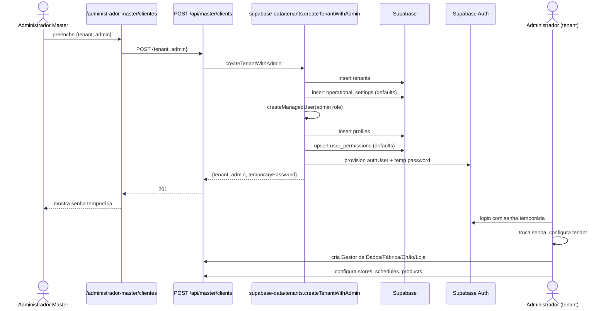
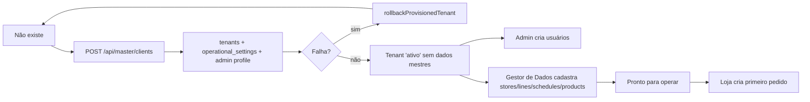

# Jornada 6 — Onboarding de Tenant

> Administrador Master cria um cliente (tenant) → cria primeiros usuários → cliente recebe dados mestres mínimos → estado "pronto para operar".

## Atores envolvidos

| Ordem | Persona | Permissão | Papel |
|------:|---------|-----------|-------|
| 1 | **Administrador Master** | `administrador-master.clientes` ≥ `gerenciar` | Provisiona tenant + admin |
| 2 | **Administrador do tenant** | herda permissões padrão de `administrador` | Configura dados mestres |
| 3 | **Gestor de Dados** (criado pelo admin) | `master_data` (várias chaves) | Carrega catálogos, lojas, cronogramas |
| 4 | **Loja / Fábrica / Chão** | conforme módulo | Passam a operar (jornadas 30+) |

## Pré-condições

- Sessão master autenticada — `isMasterRole(actorRole)` em `src/lib/tenant.ts` (referenciada em `src/app/api/master/clients/route.ts:9,66`).
- Schema com tabelas `tenants`, `profiles`, `operational_settings`, `user_permissions`, `profile_store_access`.

## Passos numerados

### Passo 1 — Master abre `/administrador-master/clientes`
- **UI:** `src/app/administrador-master/clientes/page.tsx:78-...`.
- Carrega via `useMasterClients()` → `GET /api/master/clients` (`route.ts:55-81`).
- `listMasterClients` (`tenants.ts:157-204`) traz tenants + métricas agregadas: usuários ativos, lojas, produtos, pedidos, ocorrências abertas — todos com `countByTenant`.

### Passo 2 — Master clica "Novo cliente"
- **UI:** dialog com `tenant.name`, `tenant.status`, `admin.name`, `admin.email`, `admin.status`.
- **API:** `POST /api/master/clients` (`route.ts:83-119`).
- Normaliza payload em `normalizePayload` (linhas 22-53).

### Passo 3 — Provisionamento atômico
- **Server:** `createTenantWithAdmin` (`tenants.ts:206-292`):
  1. `assertTenantAdminEmailAvailable(email)` — confere `profiles.email` único globalmente.
  2. `buildUniqueTenantSlug(name)` — gera slug a partir do nome, deduplica (`tenant`, `tenant-2`, ...).
  3. **Insere `tenants`** `{legacy_id:'tenant-<uuid>', slug, name, status}`.
  4. **Insere `operational_settings`** com defaults (`order_cutoff_time:'18:00'`, `expedition_lead_days:0`, `sale_lead_days:1`).
  5. **Cria admin** via `createManagedUser` (`admin-users.ts:542-590`):
     - Insert em `profiles` `{legacy_id:'user-<uuid>', tenant_id, name, email, role:'administrador', status, country:'Brasil'}`.
     - `upsertPermissions` aplica `buildDefaultPermissions("administrador")` em `user_permissions`.
     - `syncStoreAccess` (nenhuma loja inicial → no-op).
     - `syncProfileAuthUser` cria usuário no Supabase Auth com `buildTemporaryPassword(email, role)`.
  6. Retorna `{tenant, admin, temporaryPassword}` — UI mostra a senha temporária para o master copiar.
- **Rollback automático:** qualquer erro após criar `tenants` aciona `rollbackProvisionedTenant` (`tenants.ts:109-124`) — apaga `profiles` filhos e a `tenants` row. Falha de rollback gera mensagem composta.

### Passo 4 — Admin do tenant entra e configura dados mestres
- Após login com a senha temporária (e troca obrigatória — convenção em `auth-credentials.ts`):
  - **Acessa** `/administrador` (módulos de configuração).
  - **Cria usuários adicionais** (Gestor de Dados, Gestor de Fábrica, Chão, Loja) — `createManagedUser` reusado, validação de role via `assertManagedUserRoleForTenant`.
- **Dados mestres mínimos** (criados normalmente pelo Gestor de Dados via `master_data-admin.ts`):
  - `stores` (com `orderingDays`, `receivingDays`, `receiveWindow`).
  - `sectors` / `production_lines` / `weekly_production_schedules`.
  - `products` (com `salesToKgFactor`, `minimumProductionKg`, `productionDays`).
  - Categorias / subcategorias / unidades operacionais.
- **Ajuste de `operational_settings`** (cutoff, expedition lead days, sale lead days) na própria tela do admin.

### Passo 5 — Master pode "entrar" no tenant em modo somente-leitura
- `enterTenantReadOnly` em `use-master-clients.ts` — usa `master-access-context.ts` para criar uma sessão "espiada" sem assumir identidade.
- Master vê o que o cliente vê (jornadas 30-34) com mesmo layout, banner indicando modo readonly.

### Passo 6 — Estado "pronto para operar"
- O tenant é considerado pronto quando:
  - Pelo menos uma `store` ativa.
  - Pelo menos um cronograma ativo cobrindo a semana.
  - Pelo menos um produto com `productionDays` válidos.
  - `operational_settings` revisada (não-default, opcional).
- A loja consegue criar o **primeiro pedido** (jornada 30). KPI inicial em `/administrador-master/clientes/[tenantId]/page.tsx` mostra contagens em zero, depois sobe.

## Tabelas mutadas no onboarding

```
tenants
operational_settings           <- defaults inseridos
profiles                       <- admin (+ usuários subsequentes)
user_permissions               <- defaults por role
profile_store_access           <- conforme storeIds
auth.users (Supabase Auth)     <- via createManagedUser/syncProfileAuthUser
```

E nos passos subsequentes (não na criação atômica):
```
stores, sectors, production_lines, weekly_production_schedules,
schedule_items, categories, subcategories, operational_subcategories,
products, product_preparation_steps, business_codes (seed por contador)
```

## Diagrama de sequência



## Diagrama (Mermaid flowchart de estado do tenant)



## Pós-condições

- Linha em `tenants` com `slug` único.
- `operational_settings` default ligada ao tenant.
- Pelo menos 1 `profile` com role `administrador` + auth user.
- Permissões default em `user_permissions`.
- Cliente aparece em `listMasterClients` com métricas calculadas.

## Pontos de falha conhecidos

| Falha | Origem | Tratamento |
|-------|--------|------------|
| Email do admin já cadastrado | `assertTenantAdminEmailAvailable` (`tenants.ts:89-107`) | 409 com `MASTER_CLIENT_ADMIN_EMAIL_CONFLICT_MESSAGE` |
| Provisionamento parcial (auth falhou após inserts) | try/catch em `createTenantWithAdmin` | `rollbackProvisionedTenant` apaga; se rollback falhar, mensagem composta |
| Slug duplicado em paralelo | `buildUniqueTenantSlug` faz LIKE | Race condition possível → UNIQUE constraint no banco pega |
| `operational_settings` ausente após defeito | depende do schema | UI usa fallback em `getMasterDataSnapshot` |
| Usuário master sem `isMasterRole` | `route.ts:66`, `route.ts:94` | 403 "Apenas o administrador master..." |

## Riscos / áreas frágeis

- O onboarding **não cria** stores/produtos/cronogramas automaticamente — tenant fica `ativo` mas inoperante até alguém cadastrar. Não há "seed" forte para minimum viable tenant.
- A senha temporária volta **apenas no response** do POST; se o master perder, não há reset por essa rota (precisa usar fluxos auth padrão).
- O modo "espiar como master" (`enterTenantReadOnly`) compartilha sessão Supabase com permissões elevadas (admin do cliente) — read-only é enforced apenas no client + camada de autorização (`requireWritableTenant`).
