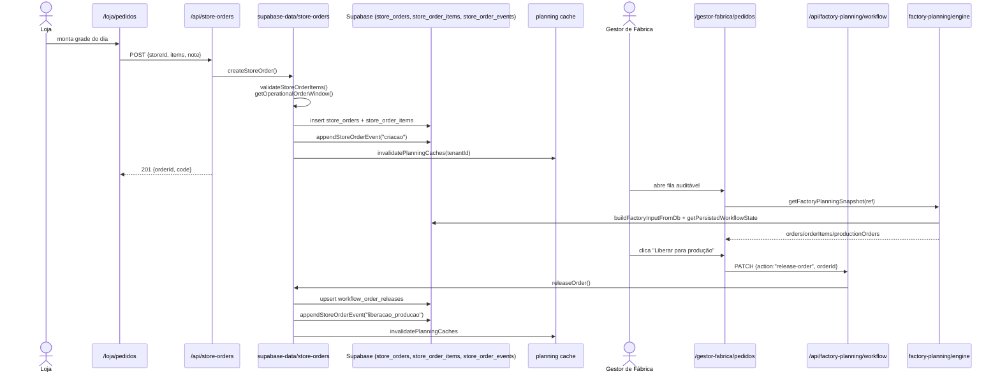

# Jornada 1 — Pedido da Loja

> Loja monta pedido D+X → envia → Gestor de Fábrica audita e libera → cronograma é impactado.

## Atores envolvidos (ordem)

| Ordem | Persona | Permissão exigida | Papel na jornada |
|------:|---------|-------------------|------------------|
| 1 | **Loja** (`loja.pedidos` ≥ `operar`) | escreve pedido | Monta itens no catálogo do dia da venda |
| 2 | **Gestor de Fábrica** (`gestor-fabrica.pedidos` ≥ `operar`) | audita | Revisa carga consolidada, libera para produção |
| 3 | (paralelo) Motor `factory-planning/engine.ts` | — | Recalcula janela, OPs, expedição, datas |

## Pré-condições

- Tenant ativo, com `operational_settings` (cutoff, expeditionLeadDays, saleLeadDays) — criado no onboarding (vide jornada 35).
- Loja `status = 'ativo'` com `orderingDays` e `receivingDays` configurados em `stores`.
- Usuário com vínculo a uma ou mais lojas (`allowedStoreIds`), validado em `canAccessStore` (`src/lib/api-auth.ts`).
- Catálogo do produto disponível na **janela operacional** (cronograma ativo da linha cobre o dia de produção): regra calculada em `buildStoreOrderCatalog` + `store-order-types.ts:availability`.
- Não existir outro pedido **ativo** da mesma loja para a mesma `delivery_date` (`store-orders.ts:365-377`).

## Passos numerados

### Passo 1 — Loja abre a tela de pedidos
- **UI:** `src/app/loja/pedidos/page.tsx:161-1235`
- **Carregamento:**
  - `useStoreOrderSummaries(anchorDate)` (`use-store-orders.ts`) → `GET /api/store-orders` (`src/app/api/store-orders/route.ts:33-95`)
  - `useStoreOrderCatalog(selectedStoreId, orderedAtIso)` → consulta o catálogo (`store-order-catalog.ts` + `buildStoreOrderCatalog`)
  - `useOperationalDateScope()` define a janela visível.

### Passo 2 — Loja preenche grade do dia
- **Ação humana:** seleciona loja (se vinculada a várias), preenche quantidade na coluna do **dia ativo** (regra `highlightedDay` baseada em `saleDate`).
- **Regras locais (`src/app/loja/pedidos/page.tsx:559-587`):**
  - Quantidades inteiras quando `unitKind === "discrete"`.
  - Confronta `salesToKgFactor × quantidade` contra `minimumProductionKg` somando agregado de outras lojas (`/api/store-orders/aggregated-quantities`).
  - Avisos não bloqueiam; confirmação reaparece em `handleOpenOrderConfirmation` (linhas 606-647).

### Passo 3 — Loja confirma o pedido
- **UI:** dialog "Confirmar pedido" (`page.tsx:1101-1211`).
- **API chamada:** `POST /api/store-orders` (`src/app/api/store-orders/route.ts:97-141`).
- **Server action:** `createStoreOrder` (`src/lib/supabase-data/store-orders.ts:344-427`):
  1. `validateStoreOrderItems` (linhas 141-229): dedup, checa `available`, unidade, kg, número discreto.
  2. `getOperationalOrderWindow` (`factory-planning/engine.ts:165-174`) calcula `baseDate` + `deliveryDate` (cutoff + receivingDays).
  3. Insere em `store_orders` (snapshot de `receive_window`, `expedition_lead_days`, `note`).
  4. `replaceStoreOrderItems` (linhas 231-261) grava `store_order_items` com snapshots (`product_code_snapshot`, `internal_kg_snapshot`, `expedition_unit_snapshot`).
  5. `appendStoreOrderEvent` registra evento `criacao` (`store-order-events.ts:56`).
  6. `invalidatePlanningCaches(tenantId)` — força recálculo da próxima consulta.
- **Tabelas mutadas:** `store_orders`, `store_order_items`, `store_order_events`, `business_codes` (via `allocateBusinessCode`).

### Passo 4 — Pedido aparece na fila do Gestor de Fábrica
- **Trigger implícito:** próxima leitura da `getFactoryPlanningSnapshot` (`src/lib/supabase-data/planning-snapshot.ts:33-59`) reconstrói:
  - `factoryInput` via `buildFactoryInputFromDb` (`store-orders.ts:307-342`).
  - `workflowState` via `getPersistedWorkflowState` (`workflow.ts:27-66`).
  - `buildFactoryPlanningData` (`factory-planning/engine.ts:944-988`) produz `orders`, `orderItems`, `productionOrders`, `expedition`.
- **UI consumidora:** `src/app/gestor-fabrica/pedidos/page.tsx:46-666`.
- **KPIs:** total, liberados, em produção, prontos p/ expedição (linhas 159-164).

### Passo 5 — Gestor audita e libera para produção
- **Ação humana:** clica "Liberar para produção" (`page.tsx:391-406`); só habilita se `availableForRelease` e `!releasedToProduction`.
- **API:** `PATCH /api/factory-planning/workflow` com `action: "release-order"` (`route.ts:36-56`).
- **Server:** `releaseOrder` (`workflow.ts:149-187`):
  - Insere/atualiza `workflow_order_releases` (`onConflict: order_id`).
  - Grava evento `liberacao_producao` em `store_order_events`.
  - Invalida cache de planning.
- **Efeito no engine:** próxima leitura marca `releasedToProduction = true` no item planejado → produção fica visível e editável em `chao-fabrica/ordens-producao` (jornada 32).

### Passo 6 — Cancelamento ou reabertura (caminho alternativo)
- Loja: `DELETE /api/store-orders/[orderId]` (`route.ts:261-301`) chama `cancelOrder` (`workflow.ts:275-326`). Só permitido se **não** existir release.
- Gestor de Fábrica: pode `cancel-order` ou `reopen-order` (`route.ts:58-84`).
- Marca `management_status='cancelado'` em `store_orders`; reabertura zera e grava evento `reabertura`.

## Estados intermediários (máquina de estados)

```
                +----------------+
                |   inexistente  |
                +----------------+
                         |
                         | createStoreOrder
                         v
+----------------------------------------------+
| store_orders.management_status = 'ativo'     |
| derived status = 'em_espera' (sem agenda)    |
| ou 'agendado' (com schedule)                 |
+----------------------------------------------+
        |  releaseOrder            |  cancelOrder
        v                          v
+------------------+      +----------------------+
| em_producao /    |      | management_status=   |
| aguardando_exped |      | cancelado            |
+------------------+      +----------------------+
                                   |  reopenOrder
                                   v
                          (volta para 'ativo')
```

Status derivado em `getOrderStatusFromItems` (`engine.ts:740-747`):
`em_espera` → `agendado` → `em_producao` → `aguardando_expedicao` → (jornada de entrega).

## Diagrama de sequência (Mermaid)



## Pós-condições

- Linha em `store_orders` (com `delivery_date`, `expedition_lead_days_snapshot`, `receive_window_snapshot`).
- Itens em `store_order_items`, eventos cronológicos em `store_order_events`.
- Quando liberado: linha em `workflow_order_releases`; OP visível em `productionOrders` consumido pelas telas de chão de fábrica (jornada 32).
- Item operacional do pedido recebe um `productionItemKey` (`engine.ts:555-562`) que será usado para mutar status em `workflow_production_items`.

## Pontos de falha conhecidos

| Falha | Origem | Tratamento atual |
|-------|--------|------------------|
| Pedido duplicado para mesma loja+`delivery_date` | `store-orders.ts:373-377` | Erro 400 mensagem em pt-BR |
| Produto fora da janela (catálogo `available=false`) | `store-orders.ts:200-206` | Erro com `blockedReason` |
| Edição de pedido já liberado | `ensureOrderIsMutable` (`store-orders.ts:97-119`) | Erro "Orders already released" |
| Cancelamento de pedido liberado | `cancelOrder` (`workflow.ts:290-294`) | Bloqueado |
| Item discreto com fração | `store-orders.ts:216-218` | "Discrete units only accept whole numbers" |
| Janela operacional inválida (loja sem dias permitidos) | `moveToNextAllowedWeekday` (`engine.ts:131-145`) | Avança até 7 dias; sem fallback definitivo |

## Observações de risco

- O **alerta de mínimo produtivo** (`getMinimumProductionAlert`) só é visual — a loja pode confirmar abaixo do mínimo e a fábrica receberá o pedido mesmo assim, levando a uma decisão silenciosa em `releaseOrder` (sem rejeição automática).
- `invalidatePlanningCaches` é **best-effort por servidor**: em deploys com múltiplos processos, cada um tem seu cache; uma tela aberta em outro nó pode mostrar dados stale por até `FACTORY_PLANNING_CACHE_TTL_MS` (10s).
