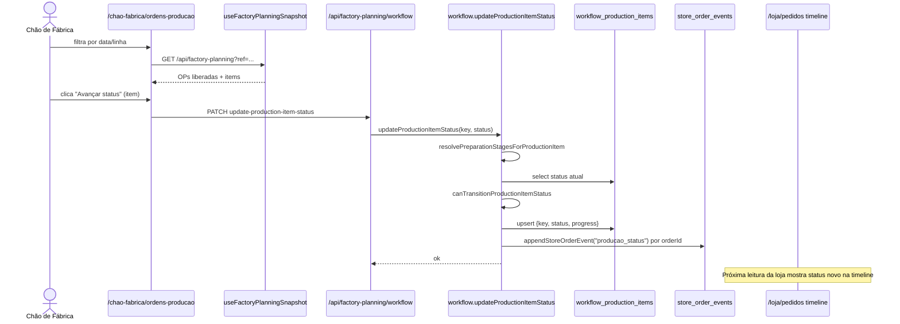

# Jornada 3 — Produção do Dia

> Chão de Fábrica recebe OPs liberadas → avança status item a item (preparação → produção → forno → embalando → concluído) → libera o pedido para expedição.

> [!note] Atualizado em 2026-05-21 — iniciativa A1-A8
> A jornada manteve a mesma estrutura, mas ganhou **timeline persistida** por OP e
> ajustes na expansão de MPI:
>
> - **Timeline auditável (A5):** toda chamada de `updateProductionItemStatus` agora
>   também grava uma linha em `production_order_events` (indexada por
>   `planning_key`, não por `opCode`). Card "Histórico da OP" no detalhe da OP
>   mostra cronologicamente cada transição. Ver [[Runbook A1-A8#6. Histórico (timeline) da OP|Runbook §6]].
> - **MPI em linha nativa (A4):** quando `mpiProduct.operationalLineId` ou
>   `mpiProduct.lineId` está cadastrado e difere da linha do pai, a OP do MPI
>   passa a rodar na linha nativa — `scheduleId` herdado do pai é descartado.
>   Para cadastros sem linha nativa, comportamento idêntico ao da fase 1
>   (herda do pai). Ver [[decisoes/ADR_expansao_mpi_em_op#Fase 2 — concluída 2026-05-21]].
> - **Métricas derivadas da timeline (A7):** o card "Métricas operacionais" do
>   gestor calcula lead time por estágio (média) a partir desses eventos.
>
> Referência completa: [[decisoes/ADR_iniciativa_automacao_pedido_entrega]].

## Atores envolvidos

| Ordem | Persona | Permissão | Papel |
|------:|---------|-----------|-------|
| 1 | **Gestor de Fábrica** | `gestor-fabrica.ops` ≥ `operar` | Pode atuar como reforço |
| 1 | **Chão de Fábrica** | `chao-fabrica.ops` ≥ `operar` | Operação principal — toca os status |
| auto | Motor `factory-planning` | — | Recalcula progresso e status de pedido |

A API aceita qualquer das duas permissões (`anyOfPermissions` em `src/app/api/factory-planning/workflow/route.ts:86-93`).

## Pré-condições

- Pedido com `workflow_order_releases` (liberado, jornada 30/31).
- Produto com `productionItemKey` válido (cronograma ativo cobrindo o dia).
- `product_preparation_steps` (opcional): se ausentes, usa `defaultProductPreparationStages` em `production-planning.ts` (`em_preparacao`, `em_producao`, `em_forno`, `embalando`).

## Passos numerados

### Passo 1 — Operador abre a fila de OPs
- **UI:** `src/app/chao-fabrica/ordens-producao/page.tsx:64-...`.
- Mostra `OpQueueRow` (linhas 89-98) com `capacityKg` (`production_lines.capacityPerDayKg`), `completion`, `productsCount`.
- Filtros: data de produção, status, sector, line, search por código/linha/produto (linhas 100-120).
- Mesma origem de dados (`useFactoryPlanningSnapshot`); diferença é que **só OPs liberadas** aparecem em destaque.

### Passo 2 — Operador abre a OP
- **UI detalhe:** `src/app/chao-fabrica/ordens-producao/[opId]/page.tsx` (e versão gestor em `gestor-fabrica/ordens-producao/[opId]/page.tsx`).
- Mostra `items` (produtos consolidados) e `sourceItems` (origem por pedido) — ambos vindos de `productionOrders[opId]`.

### Passo 3 — Operador avança o status do item
- **UI:** `ProductionOrderStatusDialog` + `ProductionOrderActionsMenu` (`src/components/production/`).
- Helpers:
  - `getNextProductionItemStatus` / `getPreviousProductionItemStatus` (`production-workflow.ts:94-...`)
  - `canTransitionProductionItemStatus` (`production-workflow.ts:74-92`) — exige passo único (+1 ou -1 no fluxo).
- **API:** `PATCH /api/factory-planning/workflow` body `{ action:"update-production-item-status", productionItemKey, status }` (`route.ts:86-112`).
- **Server:** `updateProductionItemStatus` (`workflow.ts:189-246`):
  1. `resolvePreparationStagesForProductionItem` — lê `product_preparation_steps` filtrado por produto.
  2. Lê status atual de `workflow_production_items` (`production_item_key`).
  3. Valida transição (passo único, sem pular estágio).
  4. `upsert workflow_production_items` `{ production_item_key, status, progress, updated_by_profile_id }`.
  5. `appendOrderEventsForProductionItem` (linhas 68-107): reconstrói planning, encontra **todos os pedidos** que compartilham o `productionItemKey` e grava evento `producao_status` em `store_order_events` para cada um.
  6. Invalida `planning caches`.

### Passo 4 — Registro do "drop antes/depois do forno"
- **Não há campo dedicado para drop.** A separação entre antes/depois do forno é via os **status** sucessivos: `em_producao → em_forno → embalando`.
- O progresso é numérico (`getProductionStatusProgress`) e é o que sobe o status do pedido em `getOrderStatusFromItems` (`engine.ts`).
- Observações textuais entram em `store_order_events.description/metadata` (apenas via APIs de avanço; não há formulário de "drop" hoje).

### Passo 5 — Conclusão do item e da OP
- Status final `concluido` (`production-workflow.ts:18`) com progress = 100.
- Quando **todos** os `sourceItems` de uma OP estão concluídos, `productionOrders[op].progress >= 100` → `status = aguardando_expedicao` (`engine.ts:740-747`).
- Quando **todos** os itens de um **pedido** atingem 100, `PlannedOrderRow.status = aguardando_expedicao` (`buildOrders` em `engine.ts:806-853`).
- A transição para expedição é automática: o pedido fica disponível em `/chao-fabrica/expedicao` (`isOrderReadyForDeliveryExecution` em `delivery-workflow.ts:55-57`).

### Passo 6 — Eventos cronológicos
- Toda mudança em produção gera evento `producao_status` em `store_order_events` para cada pedido tocado.
- A loja vê esses eventos em `/loja/pedidos/[orderId]` (timeline em `src/app/loja/pedidos/[orderId]/page.tsx:623-644`).
- **Desde 2026-05-21 (A5):** mesma chamada grava também uma linha em
  `production_order_events` (indexada por `planning_key`), consumida pelo card
  "Histórico da OP" em `/gestor-fabrica/ordens-producao/[opId]`. Os dois
  registros são complementares: `store_order_events` é a visão do pedido,
  `production_order_events` é a visão da OP. Ambos append-only.

## Máquina de estados (item de produção)

```
+---------------+
| nao_iniciado  |
+-------+-------+
        |
        | next
        v
+---------------+        +---------------+        +-----------+
| em_preparacao | -----> | em_producao   | -----> |  em_forno |
+---------------+        +---------------+        +-----+-----+
                                                         |
                                                         v
                                                  +-------------+
                                                  |  embalando  |
                                                  +------+------+
                                                         |
                                                         v
                                                  +--------------+
                                                  |  concluido   |
                                                  +--------------+
```
- `canTransitionProductionItemStatus` só permite ±1 passo.
- Se o produto tiver `product_preparation_steps` customizadas (subconjunto/ordem diferente), o fluxo respeita essa lista (`normalizeProductPreparationStages`).

## Diagrama de sequência (Mermaid)



## Pós-condições

- `workflow_production_items` com `production_item_key`, `status`, `progress`, `updated_at`, `updated_by_profile_id`.
- `store_order_events` com 1 linha por pedido afetado.
- Snapshot derivado: `ProductionOrderRow.progress`, `PlannedOrderRow.status`, `ExpeditionRow.status` propagados.

## Pontos de falha conhecidos

| Falha | Origem | Tratamento |
|-------|--------|------------|
| Transição inválida (pular estágio) | `workflow.ts:216-218` | Erro 400 "Invalid production workflow transition" |
| `productionItemKey` divergente entre snapshot e DB | `engine.ts:555-562` + `getProductionItemKey` | Item fica "órfão" — não atualiza pedido relacionado |
| Pedido **não** liberado tendo status avançado | Nada impede chamar API com key conhecida (fallback de segurança em camada de UI apenas) | Risco: criar status fantasma sem release |
| Sem `product_preparation_steps` aplicáveis | fallback `defaultProductPreparationStages` | Operador vê estágios "genéricos" — pode discordar da ficha técnica |
| Tabela `workflow_production_items` ausente em deploy antigo | `isSupabaseMissingSchemaError` (`workflow.ts:208-211`) | Lê como vazio; UI mostra `nao_iniciado` |

## Riscos operacionais

- **Não há trava de release**: a API valida apenas a transição do **estágio**, não exige que `workflow_order_releases` exista para o pedido relacionado. Em teoria, um operador com chave bem escolhida pode mexer em produção de pedido não liberado.
- **Concorrência**: dois operadores avançando o mesmo `productionItemKey` simultaneamente fazem upsert; o último vence. O `getProductionItemKey` é único por dia/linha/cronograma/produto — concorrência intra-produto é possível.
