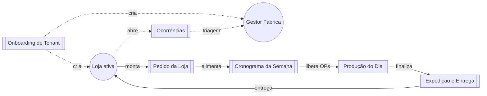

# Jornadas — Visão Geral

> 6 jornadas operacionais + 1 transversal de integrações. Cada uma é um caminho ponta-a-ponta com atores, APIs, tabelas mutadas, máquina de estados e diagrama Mermaid.

## Mapa global

## Lista

| Jornada | Ator principal | Resumo |
|---|---|---|
| [[Jornada — Pedido da Loja]] | [[Loja]] | Monta pedido D+X, valida lote/disponibilidade, envia para fábrica. |
| [[Jornada — Cronograma da Semana]] | [[Gestor de Fábrica]] | Audita snapshot, define prioridades por dia, libera ordens. |
| [[Jornada — Produção do Dia]] | [[Chão de Fábrica]] | Executa OPs, registra drop antes/depois, fecha. |
| [[Jornada — Expedição e Entrega]] | [[Chão de Fábrica]] (+ Gestor Fábrica) | Agrupa por loja, checklist, rota, entrega. |
| [[Jornada — Ocorrências]] | [[Loja]] → [[Gestor de Fábrica]] | Loja registra problema; fábrica triagem e resolve. |
| [[Jornada — Onboarding de Tenant]] | [[Administrador Master]] | Cria cliente novo, primeiros usuários, dados mínimos. |
| [[Integrações entre Jornadas]] | — | Handoffs e contratos entre as jornadas acima. |

## Top 5 transições frágeis (mapeadas em 2026-05-13)

Aprofundadas em [[Integrações entre Jornadas]]:

1. **Engine → "aguardando_expedicao"** — promoção derivada em runtime (`engine.ts:740-747`), **não persistida** em `store_orders`; loja **não vê evento** quando produção termina.
2. **Chão pode mexer em produção de pedido cancelado** — `updateProductionItemStatus` valida ±1 estágio mas não exige `workflow_order_releases`.
3. **`productionItemKey` compartilhado entre pedidos** (`workflow.ts:86-106`) — fan-out implícito; avançar status afeta N pedidos sem possibilidade de desagregar.
4. **Checklist de expedição depende de `expedition_unit` estável** (`delivery.ts:93-107`) — mudar unidade do produto invalida `checklistState` antigo; pedido trava em `aguardando_expedicao` sem mensagem clara.
5. **Status visto pela loja combina `orderStatus` + `executionStatus`** (`resolveStoreVisibleOrderStatus`) — com cache de 10s entre nós, loja pode ver "em rota" antes da produção tecnicamente fechar.

Ver [[Dívida Técnica]].

## Como usar este conjunto

- **Vai mexer numa tela?** → identifique a persona → vá para a jornada onde ela aparece → siga os passos numerados até o ponto da mudança.
- **Vai mexer numa regra?** → veja qual(is) jornada(s) usam a regra → atualize a regra (`05 - Regras`) e atualize a referência na(s) jornada(s).
- **Vai mexer no fluxo (estado/máquina)?** → cuidado com [[Integrações entre Jornadas]] — mudanças aqui têm blast radius alto.
