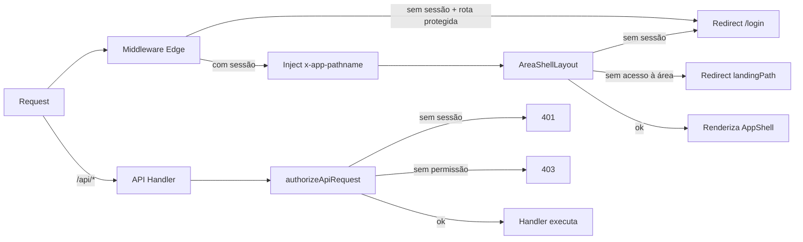

# Autenticação e Sessão

> Camadas 1 e 2 da pipeline de autorização: middleware Edge → Layout Server Component. Para a camada 3 (API), ver [[Autorização de API]].

## Pipeline geral

## 1. Middleware Edge (`middleware.ts`)

Arquivo: `middleware.ts:1-51`.

### Comportamento

1. **`middleware.ts:26-28`** — pula APIs: qualquer path iniciado por `/api` retorna `NextResponse.next()`.
   > ⚠️ Importante: **API authn é responsabilidade do handler, não do middleware**.
2. **`middleware.ts:30-31`** — cria cliente Supabase via `createSupabaseRequestClient`, lê o usuário com `supabase.auth.getUser()`.
3. **`middleware.ts:33`** — chama `resolveMiddlewareRouting` (`src/lib/middleware-routing.ts:21-41`).
4. Se decisão = `redirect` → `NextResponse.redirect` + cookies aplicados.
5. Senão → `NextResponse.next` injetando header `x-app-pathname` (`middleware.ts:11-12`), consumido por `src/lib/app-shell.ts:30-37`.

### Regras de roteamento (`resolveMiddlewareRouting`)

- `/login` sempre passa (`middleware-routing.ts:28-30`).
- **Sem sessão** + (`/` OU `isProtectedAppPath`) → redirect para `/login?next=<destino>` (`middleware-routing.ts:32-38`). `buildLoginRedirectPath` codifica o destino original.
- `isProtectedAppPath` (`src/lib/permission-modules.ts:666-670`): retorna `true` se path começa com algum `appAreaPath` (`/administrador-master`, `/administrador`, `/gestor-dados`, `/gestor-fabrica`, `/chao-fabrica`, `/loja`).

### Matcher

`middleware.ts:49-51` — aplica em tudo menos `_next/static`, `_next/image`, `favicon.ico` e arquivos com extensão.

### Auditoria

Cada redirect chama `logMiddlewareRedirect` (`src/lib/access-audit.ts:38-50`) → `console.warn` com prefixo `[access-control]` em JSON.

### Achado

> ⚠️ `/impressao` não está em `appAreaPath` → não dispara `isProtectedAppPath`. As 4 páginas `/impressao/{pre-pesagem,producao,expedicao,pedido-loja}` podem ser acessadas anonimamente se as próprias `page.tsx` não chamarem `resolveServerAccess`. Auditar. Ver [[Riscos de Segurança]].

## 2. Sessão e tenant context

Arquivos: `src/lib/server-session.ts:1-167`, `src/lib/master-access-context.ts:1-46`, `src/lib/tenant.ts:1-43`.

### Determinação da persona

`resolveServerAccess` em `server-session.ts:88-167`:

1. Chama `supabase.auth.getUser()`.
2. Cruza com `public.profiles` via `findManagedUserByAuthUserId` (`server-session.ts:50-59`). Carrega `permissions` (de `user_permissions`), `tenant_id`, `status`, opcionalmente `storeIds` (de `profile_store_access`).
3. Se `status !== "ativo"` → retorna `null` (sessão inválida, `server-session.ts:101-103`).
4. Para **personas não-master** (`isMasterRole === false`): valida que `tenant` referenciado em `managedUser.tenantId` tenha `status === "ativo"` (`server-session.ts:106-113`). Tenant inativo = sessão descartada.
5. Para **`administrador-master`**: lê cookie `da_master_tenant` (`MASTER_TENANT_COOKIE_NAME` em `tenant.ts:15`) e chama `resolveMasterAccessContext`.

### Os 3 access modes

Enum `AccessMode` em `tenant.ts:4`:

| Modo | Quando | Permissões efetivas | Pode escrever? |
|---|---|---|---|
| `tenant` | Persona não-master logada no próprio tenant | `managedUser.permissions` | Sim |
| `master` | `administrador-master` sem cookie `da_master_tenant` | Suas próprias permissões master | Sim |
| `read-only-tenant` | `administrador-master` com cookie apontando para tenant ativo | `buildMasterTenantReadOnlyPermissions` (módulos não-master = `gerenciar`) | **Não** (bloqueio em `canWriteInAccessMode`, `tenant.ts:21-23`) |

### `ResolvedServerAccess`

Estrutura em `server-session.ts:28-36`:
- `user` — `ManagedUser` + `authUserId`
- `actorRole` — papel real do usuário no banco
- `actorTenantId` — tenant do usuário
- `effectiveTenantId` — tenant em que ele está "atuando" agora (master → tenant selecionado, outros → `actorTenantId`)
- `accessMode`
- `permissions` — mapa efetivo, já reescrito se for `read-only-tenant`
- `selectedTenant` — `TenantSummary` quando master selecionou cliente

## 3. AreaShellLayout (Server Component)

Arquivo: `src/components/layout/area-shell-layout.tsx:13-55`.

Cada `layout.tsx` por persona (`administrador/`, `gestor-dados/`, `gestor-fabrica/`, `chao-fabrica/`, `loja/`, `administrador-master/`) chama `<AreaShellLayout areaGroup="...">`. O componente:

1. Obtém `ResolvedAppShellContext` via `getAppShellContext` (`src/lib/app-shell.ts:20-66`), que combina `resolveServerAccess` + `resolveAreaAccess` (`src/lib/navigation-access.ts:23-70`).
2. **Sem sessão** → redirect para `/login` (com `logAreaRedirect`).
3. **`canAccessCurrentPath === false`** → redirect para `landingPath` (primeira rota permitida pelo `landingOrder`).
   - Motivos possíveis (`navigation-access.ts:20`): `foreign-profile` (ex: `gestor-fabrica` tentando `/loja/perfil`), `missing-module-access`, `missing-area-access`.
4. **OK** → renderiza `<AppShell>` com sections de navegação.

### Decoupling especial — `administrador-master`

`src/lib/app-shell.ts:38-41` — para o group `administrador-master`, usa `accessContext.user.permissions` (permissões reais master) em vez de `accessContext.permissions` (que viraria read-only-tenant em modo cliente). Mesma defesa-em-camadas do `api-permission-context.ts`.

## Cookie `da_master_tenant`

- Nome: `MASTER_TENANT_COOKIE_NAME` em `src/lib/tenant.ts:15`.
- Função: master "entra" no tenant para auditoria.
- Validação atual: derivada do `user_role === "administrador-master"` no JWT.

> ⚠️ Verificar: cookie deve ser `HttpOnly`, `Secure`, `SameSite=Strict` ou `Lax`. Se a aplicação aceita o cookie sem validar o role, qualquer persona pode "trocar" de tenant. Ver [[Riscos de Segurança#R1.3]].

## Tabela-resumo de pontos de defesa

| Camada | Arquivo | Decide o quê | Falha como |
|---|---|---|---|
| Middleware Edge | `middleware.ts` | Tem sessão? Rota protegida? | Redirect para `/login?next=...` |
| Layout (Server Component) | `area-shell-layout.tsx` | Persona pode ver esta área/módulo? | Redirect para `landingPath` |
| API handler | `api-auth.ts` (`authorizeApiRequest`) | Persona tem nível X no módulo Y? Tenant selecionado? Modo escrita? | JSON 401/403 |
| Filtro de loja | `store-access.ts` + `canAccessStore` | Recurso pertence a uma loja do usuário? | JSON 403 |
| RLS Postgres | Policies por tabela | Linha pertence ao tenant correto? Role pode operar? | Linha invisível |

Defesa em profundidade. Ver [[Autorização de API]] e [[RLS Policies]].
