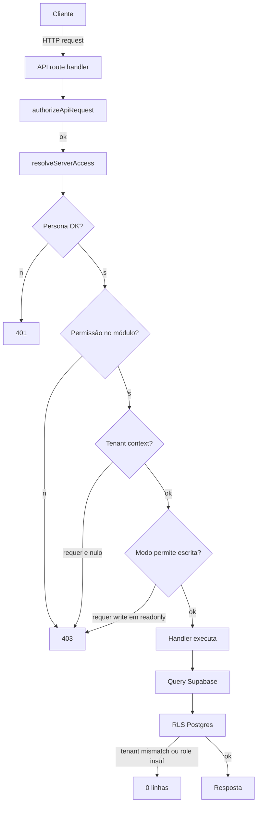

# Autorização de API

> Camada 3 da pipeline. Para camadas 1-2 (middleware + Layout), ver [[Autenticação e Sessão]].

## `authorizeApiRequest`

Arquivo: `src/lib/api-auth.ts:1-129`.

Função única que toda API route chama no topo do handler. Devolve `ResolvedServerAccess` em caso de sucesso, ou `{ response: NextResponse }` (já com 401/403 montado) em falha.

### Assinatura

```ts
authorizeApiRequest(options: {
  permission?: PermissionModuleId;
  anyOfPermissions?: PermissionModuleId[];
  minimumLevel?: PermissionLevel; // default "visualizar"
  contextLabel?: string;
  includeStoreScope?: boolean;
  requireTenantContext?: boolean;
  requireWritableTenant?: boolean;
}): Promise<ResolvedServerAccess | { response: NextResponse }>
```

### Fluxo (`api-auth.ts:49-109`)

1. **`resolveServerAccess({ includeStoreAccess })`** → obtém o contexto completo (ver [[Autenticação e Sessão]]).

2. **`resolveApiPermissionMap(access, options)`** (`src/lib/api-permission-context.ts:44-55`) — **regra especial para master**:
   - Se persona é `administrador-master` E **todos** os módulos requisitados são do grupo `administrador-master`: usa `access.user.permissions` (permissões reais).
   - Caso contrário: usa `access.permissions` (mapa contextual — pode estar em `read-only-tenant`).
   - **Por quê:** garante que master, mesmo em modo `read-only-tenant`, mantém acesso a suas APIs próprias.

3. **`resolveAuthorizationDecision`** (`src/lib/authorization-decision.ts:36-82`) avalia 4 desfechos:
   - `unauthorized` (sem usuário) → 401 `{ message: "Sessão inválida." }` (`api-auth.ts:27-29, 75-78`).
   - `forbidden` (`missing-permission` ou `missing-any-permission`) → 403 `{ message: "Você não tem permissão para esta operação." }` (`api-auth.ts:31-33, 91-94`).
   - `authorized` → continua.

4. **`requireTenantContext`** + `effectiveTenantId === null` → 403 `"Selecione um cliente no painel master..."` (`api-auth.ts:96-100, 35-40`). Usado por endpoints que dependem de tenant selecionado.

5. **`requireWritableTenant`** + modo é `read-only-tenant` → 403 `"O cliente selecionado está aberto em modo leitura."` (`api-auth.ts:102-106, 42-47`).

6. **Sucesso** → retorna `ResolvedServerAccess` para o handler.

## Cross-persona com `anyOfPermissions`

Quando um endpoint serve mais de uma persona, usa `anyOfPermissions` (array) ao invés de `permission` (single). Aceita usuário com **qualquer uma** das permissões listadas.

| Endpoint | Permissões aceitas |
|---|---|
| `src/app/api/factory-planning/route.ts:16` | `gestor-fabrica.dashboard` OR `chao-fabrica.dashboard` |
| `src/app/api/factory-planning/workflow/route.ts:89` | `gestor-fabrica.ops` OR `chao-fabrica.ops` |
| `src/app/api/delivery-executions/route.ts:24,57` | `gestor-fabrica.expedicao` OR `chao-fabrica.expedicao` |
| `src/app/api/store-occurrences/route.ts:41` | `loja.ocorrencias` OR `gestor-fabrica.ocorrencias` |
| `src/app/api/store-occurrences/[occurrenceId]/route.ts:43,77` | `loja.ocorrencias` OR `gestor-fabrica.ocorrencias` |
| `src/app/api/store-occurrences/[occurrenceId]/events/route.ts:28` | `loja.ocorrencias` OR `gestor-fabrica.ocorrencias` |
| `src/app/api/store-orders/aggregated-quantities/route.ts:10` | `loja.pedidos` OR `gestor-fabrica.pedidos` |

Lógica em `canAccessAnyPermission` (`src/lib/permission-modules.ts:524-532`) e `src/lib/authorization-decision.ts:64-76`.

## Filtro de loja (helpers `getAllowedStoreIds` / `canAccessStore`)

Apenas para persona `loja` (única com escopo por loja).

- **`getAllowedStoreIds(access)`** (`api-auth.ts:111-117`) — retorna lista de `storeIds` permitidos quando `accessMode === "tenant"`; `null` para master (sem filtro).
- **`canAccessStore(access, storeId)`** (`api-auth.ts:119-124`) — combina com `hasStoreAccess` (`src/lib/store-access.ts:6-8`).
- **`buildStoreScopeResponse()`** (`api-auth.ts:126-128`) — 403 `"O usuário autenticado não tem acesso a este registro."` quando `storeId` do recurso não está nos `storeIds` do usuário.

Uso típico em `src/app/api/store-orders/[orderId]/route.ts`:

```ts
const access = await authorizeApiRequest({ permission: "loja.pedidos", includeStoreScope: true });
if ("response" in access) return access.response;
if (!canAccessStore(access, order.storeId)) return buildStoreScopeResponse();
```

## Auditoria

Falhas (`unauthorized` e `forbidden`) emitem `logApiAuthorizationFailure` em `src/lib/access-audit.ts` com:
- `source: "api"`
- motivo
- módulo solicitado
- nível mínimo
- baseRole
- email do usuário

## Pontos de atenção

- **Cada API nova precisa de `authorizeApiRequest` no topo do handler**. Sem isso, qualquer usuário autenticado pode chamar. Ver [[Riscos de Segurança#R2.1]].
- **`includeStoreScope: true`** é necessário em rotas que precisam filtrar por loja — sem esse flag, `getAllowedStoreIds` retorna sempre `null` (porque `storeIds` não foi carregado).
- **`requireWritableTenant: true`** deve estar em **toda rota de escrita** acessível por master, senão modo `read-only-tenant` vira modo `read-write-tenant` na prática.
- **`anyOfPermissions`** vs `permission`: usar `anyOfPermissions` apenas quando o endpoint serve genuinamente múltiplas personas. Não vire bypass.
- **RLS é última defesa** — mesmo que o handler erre, RLS bloqueia leitura/escrita cross-tenant. Ver [[RLS Policies]].

## Defesa em camadas — diagrama



## Links

- [[Autenticação e Sessão]] — middleware + Layout
- [[Modelo 4 Níveis × 27 Módulos]] — níveis e enum
- [[Catálogo dos 27 Módulos]] — quais permissões existem
- [[RLS Policies]] — defesa no banco
- [[Riscos de Segurança]] — checklist de auditoria
