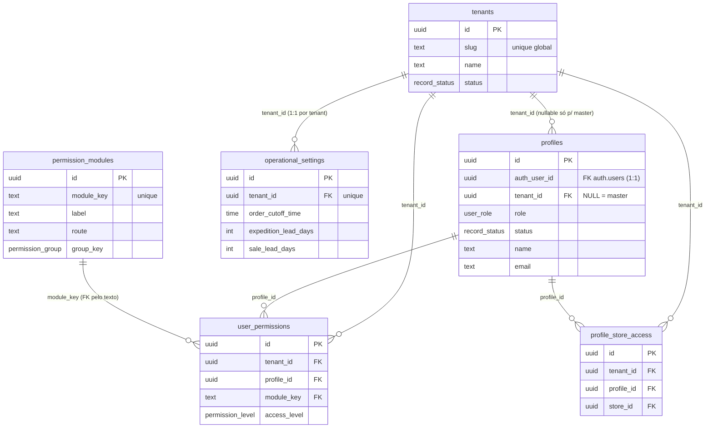
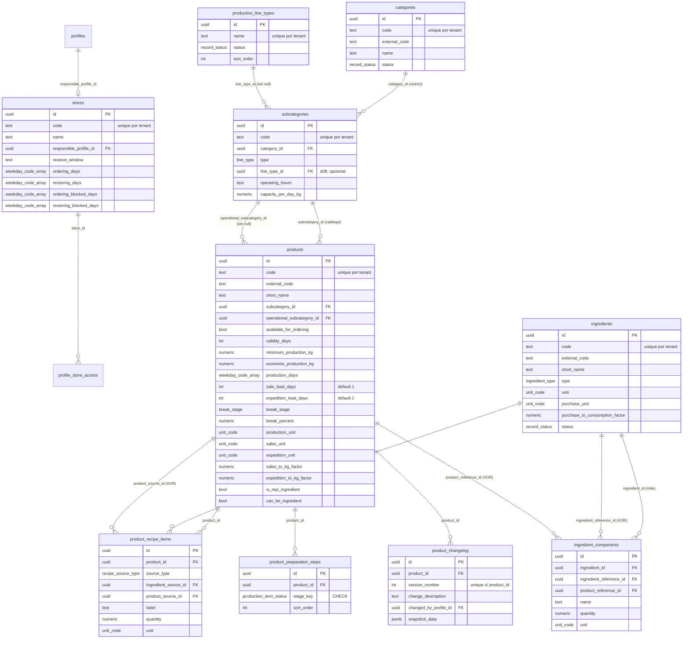
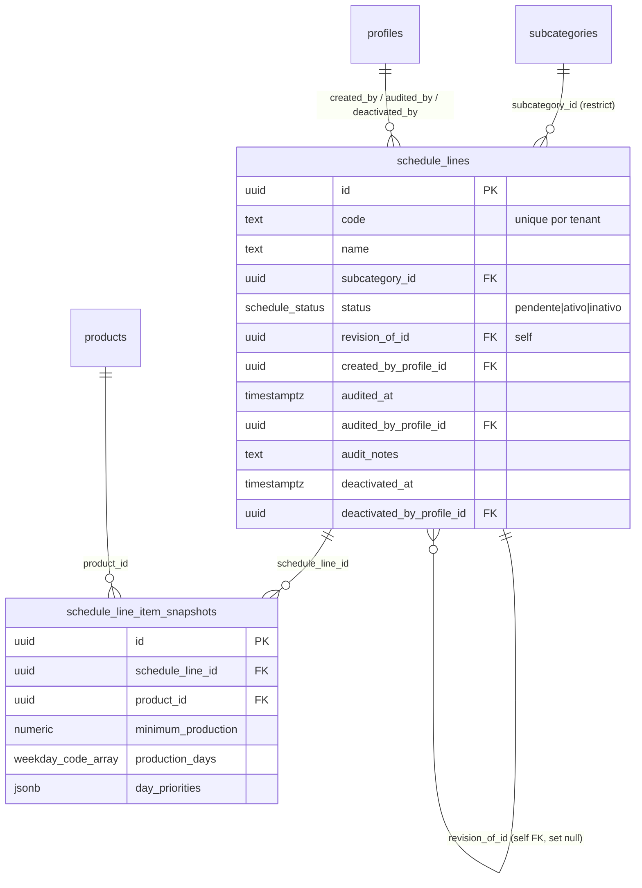
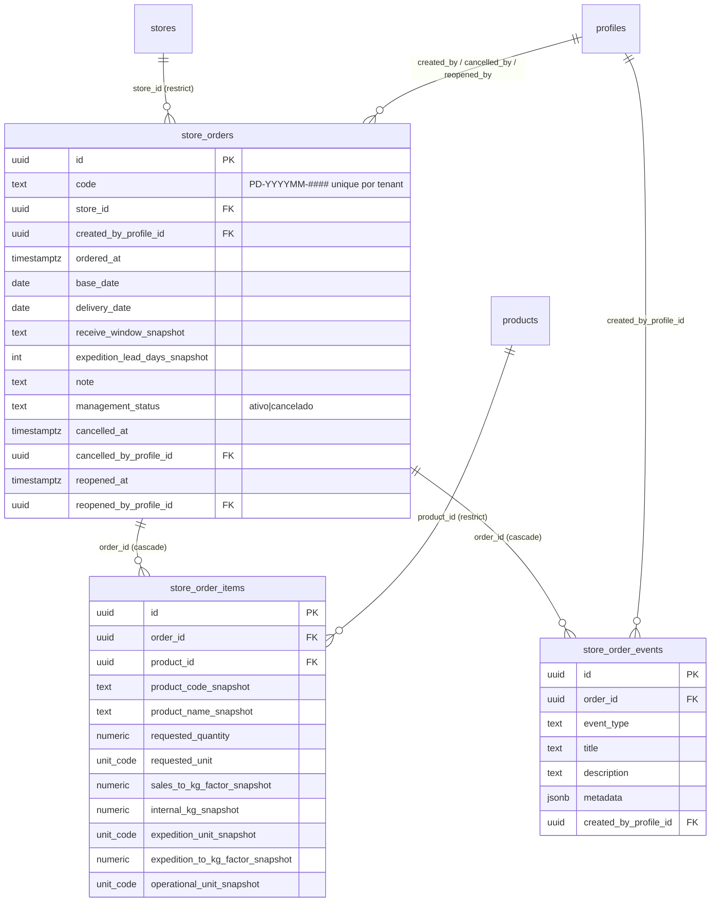
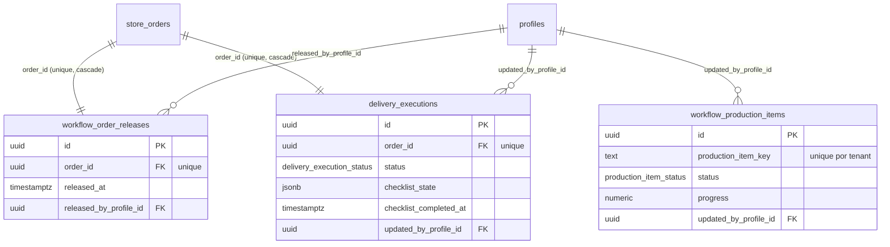
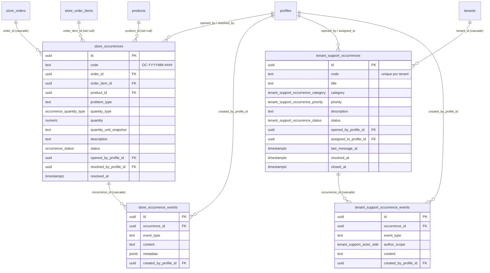
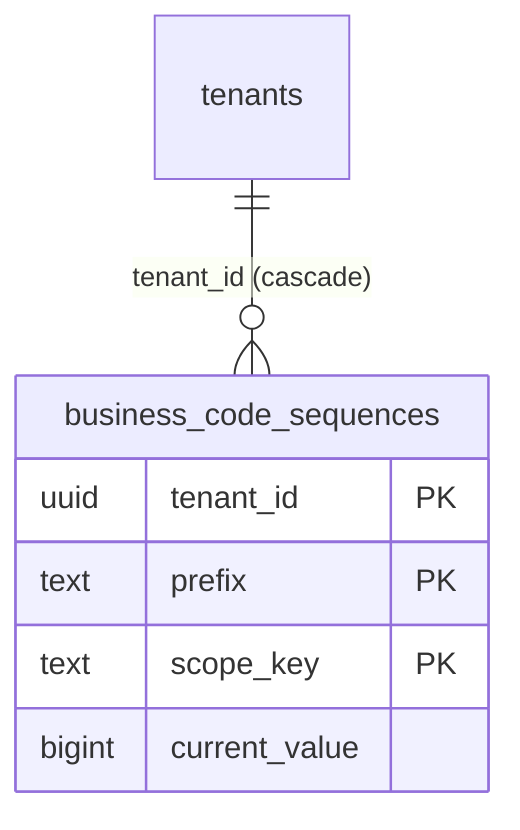

# Diagrama ER por domínio

Agrupados em 6 sub-diagramas Mermaid para legibilidade. A entidade raiz `tenants` é referenciada por quase tudo via `tenant_id` (mostrada apenas no primeiro diagrama; nos demais subentenda).

---

## (a) Tenancy / Usuários / Permissões

---

## (b) Catálogo (Lojas, Categorias, Produtos, Ingredientes, Receitas)

---

## (c) Cronograma (Schedule Lines)

---

## (d) Pedidos

---

## (e) Produção, Expedição, Entrega

Note: `workflow_production_items.production_item_key` é uma chave **textual composta** (não FK direta) — serialização de tenant + order_id + product_id + stage gerada na app. Por isso há `unique (tenant_id, production_item_key)`.

---

## (f) Ocorrências (Qualidade + Suporte SaaS)

---

## Tabela de utilitário (não-domínio)

`business_code_sequences` é tabela auxiliar (não tem relacionamentos visíveis no ER pois é manipulada apenas por funções definer):

Acesso só via `next_business_code_number()` / `rebuild_business_code_sequences()`. RLS bloqueia tudo para qualquer role.
