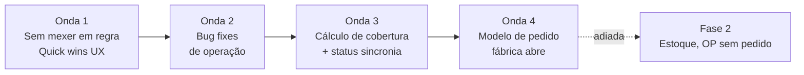

# Call 2026-05-13 — Plano de Ataque

> Sequência proposta para os 22 ajustes do [[Backlog de Ajustes]]. Otimizada para (a) liberar Daniel para testar o quanto antes, (b) evitar refactor enquanto a estrutura está sendo definida, (c) atender o compromisso "início da próxima semana" (Giuseppe) = **a partir de 2026-05-19**.

## Estratégia em 4 ondas

---

## Onda 1 — Quick wins UX (2-3 dias)

Sem mudar regra de negócio. Daniel já pode testar.

| ID | Ajuste | Esforço | Dependências |
|---|---|---|---|
| AJ-0019 | Limpar banco para testes | XS | — (faz agora) |
| AJ-0005 | Indisponíveis no fim da lista | S | — |
| AJ-0006 | Remover legenda "abaixo do mínimo" do lado loja | S | — |
| AJ-0003 | Coluna `expedition_lead_days` na auditoria | S | — |
| AJ-0004 | Decimais 1+3 em receita | S | — |
| AJ-0010 | Impressão compacta | M | — |
| AJ-0018 | Tooltips no pedido (continuar c730591) | M | — |
| AJ-0020 | Legenda ingrediente / MPI | XS | — |

**Saída:** Daniel testa um conjunto de melhorias visíveis. UX já fica claramente melhor.

---

## Onda 2 — Bug fixes operacionais (2-3 dias)

| ID | Ajuste | Esforço | Dependências |
|---|---|---|---|
| AJ-0007 | Bloquear duplicidade antes de abrir pedido | M | — (alinhar com AJ-0009 depois) |
| AJ-0008 | Investigar MPI gerando OP | M | leitura de motor |
| AJ-0012 | Log de auditoria com diff visível | M | usa `product_changelog` |
| AJ-0013 | Visibilidade de pedido agendado | S | — |
| AJ-0017 | Card "aguardando produção" navegável | S | — |
| AJ-0002 | Dashboard com cards clicáveis | M | — |

**Saída:** sistema responde de forma coerente sem confundir o operador.

---

## Onda 3 — Cálculo de cobertura + sincronia (3-5 dias)

Esses são os ajustes "de regra" que exigem mudança no motor.

| ID | Ajuste | Esforço | Notas |
|---|---|---|---|
| AJ-0014 | Quadradinhos verdes = dias de cobertura | L | Mudança no engine + UI |
| AJ-0016 | Mostrar data nos quadradinhos | S | Pendurar em AJ-0014 |
| AJ-0011 | Sincronia OP / Expedição / Entrega | L | Persistir transição derivada, emitir evento |
| AJ-0001 | Kanban read-only (acompanhamento) | L | Depende de AJ-0011 estar correto |

**Saída:** o cronograma de pedido funciona conforme o cliente entende. Operação tem visão clara.

---

## Onda 4 — Modelo fábrica-abre-pedido (1-2 semanas)

Mudança estrutural. **Não fazer no calor da hora.**

| ID | Ajuste | Esforço | Notas |
|---|---|---|---|
| AJ-0009 | Fábrica abre pedido → loja preenche | XL | Define decisões de modelo antes |

**Antes de codar:**
1. Decidir: nova tabela `order_windows` vs apenas estado em `store_orders`?
2. Decidir: como fábrica "abre" — manual, automático por cronograma, ou misto?
3. Decidir: o que acontece com pedidos atuais (migração)?
4. Documentar a decisão em [[Regra — Pedido da Loja]] (atualizar) **e** [[Jornada — Pedido da Loja]] (reescrever).

Sugestão: **adiar AJ-0009 para depois das Ondas 1-3**, fazer ronda de validação com cliente real antes de mudar modelo.

---

## Fase 2 (futuro)

Não entram agora:
- AJ-0021 — Armazenamento / estoque (shelf life)
- AJ-0022 — OP sem pedido

---

## Compromisso com o cliente

| Quem | Quando | O quê |
|---|---|---|
| Giuseppe | Onda 1 entregue até **2026-05-19 (terça)** | Daniel pode testar a partir desse dia |
| Giuseppe | Onda 2 entregue até **2026-05-22 (sexta)** | Bug fixes operacionais |
| Giuseppe | Onda 3 entregue até **2026-05-29 (sexta)** | Cobertura + Kanban |
| Daniel | Testa a partir de **2026-05-19** | Feedback de testes contínuo |
| Giuseppe + Leonora | Avaliam Onda 4 (modelo) após Onda 3 | Decisão de quando iniciar AJ-0009 |
| Call | **2026-05-20 (terça) 16h-17h** | Tira-dúvidas (se necessário) |

> ⚠️ Datas-alvo, não compromisso formal. Leonora pediu para **não prometer data fechada** ainda. Vão se ajustar conforme andamento.

## Riscos

- **AJ-0014 (cobertura)** pode revelar que a regra está mais complexa que o entendido. Reservar tempo extra.
- **AJ-0011 (status)** depende de entender o cache de 10s — pode exigir refactor maior em `delivery.ts`.
- **AJ-0009 (modelo)** é mudança que afeta documentação (jornada, regra, glossário, ER de banco se virar `order_windows`).
- Limpeza de banco (AJ-0019) é destrutiva — confirmar com Giuseppe que o ambiente é só dev.

## Métricas para acompanhar

- Tempo médio entre commit e teste por Daniel
- Quantos AJ saem de Em-andamento por semana
- Quantos AJ-#### nascem por call (medida de saúde do modelo)
